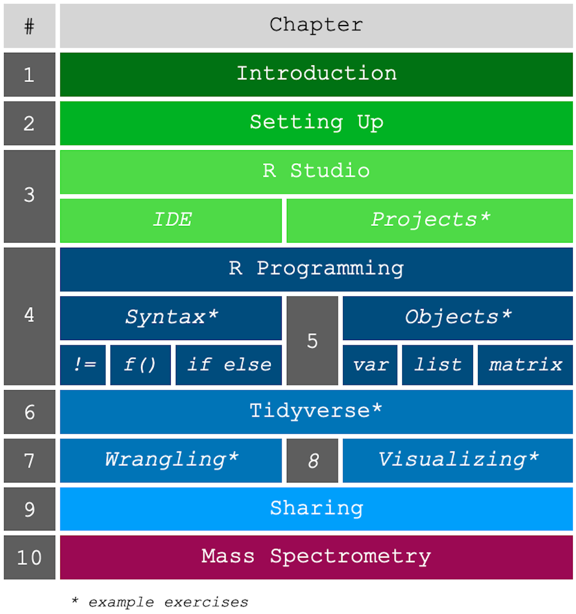

# Contents {-}

This book is organized in a manner such that each chapter builds upon the previous. There are three main sections to this book, where the first section covers the introduction to R and the Integrated Development Environment (IDE) called R Studio. The middle section is the most extensive, basically covering the R programming language its nuances and the main data science packages that will cover the majority of your day-to-day analyses. These chapters all have example exercises to work on that should help sharpen your skills. The last section covers mass spectrometry specific data and some packages you can use to work with that data. This section on mass spectrometry is not meant to be comprehensive, but rather a sample showcase for what is possible.

```{r 1000, echo=FALSE, fig.align='center'}

```
