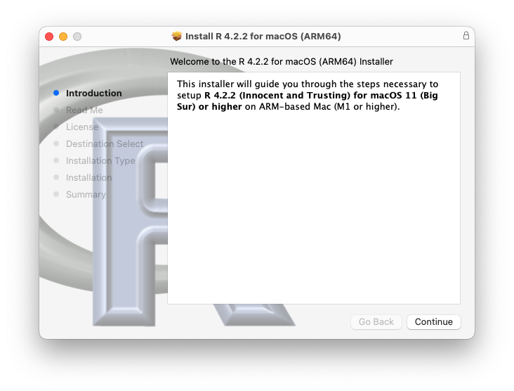

# Installation

In the scope of this book, there are three main components that need to be installed, and periodically updated:

-   **The R interpreter** - the software that understands math and plotting

-   **RStudio IDE** - the software that makes it easy write code and visualize data

-   **R Packages** - bits of R code that perform specalized operations

In this book we will be utilizing the RStudio integrated development environment (IDE) to interact with R. Two separate components are required for this - the R interpreter and the RStudio IDE. Both are required as the RStudio IDE only provides an interface for the R interpreter, which reads the code and does all the mathematical operations. The R interpreter can be used alone, interacting through the command line (eg. Windows CMD, MacOS and Linux Terminal), a plain text editor or another IDE such as Xcode, VSCode, Eclipse, Notepad++, etc. Rstudio provides a comprehensive, R specific environment, with auto-complete, code syntax highlighting, in-editor function definitions along with package management and plot visualizations.

\

+---------------------------------+----------------------------------------------------------+
| {height="68"} | **At the end of this chapter you should be able to**     |
|                                 |                                                          |
|                                 | 1.  Install R, RStudio and a few R packages              |
|                                 |                                                          |
|                                 | 2.  Understand the major components for working with R.  |
+---------------------------------+----------------------------------------------------------+

\

## R interpreter

The underlying "engine" for R programming language can be downloaded from [The R Project for Statistical Computing](https://www.r-project.org/). R is an open-source implementation of the S statistical computing language originally developed at Bell Laboratories. Both langauges contain a variety of statistical and graphical techniques, however, R has been continually extended by professional, academic and amateur contributors and remains the most active today. With the advent of open-source sharing platforms such as GitHub, R has become increasingly popular among data scientists because of its ease of use and flexibility in handling complex analyses on large datasets. Additionally, one of R's strengths is the ease with which well-designed publication-quality plots can be produced.

#### Steps {-}

1.  Navigate to [The R Project](https://www.r-project.org/)
2.  Click on [CRAN](https://cran.r-project.org/mirrors.html) under Download, left-hand side
3.  Click on <https://cloud.r-project.org/> under 0-Cloud\
    *This will take you to the globally nearest up-to-date repository*
4.  Click on `Download for ...` and choose the OS compatible with your device

#### Windows OS {-}

Click on `base`

#### MacOS {-}

**For an Intel CPU**: click `R-4.x.x.pgk` to download\
**For an M1 CPU**: click `R-4.x.x-arm64.pkg` to download

After downloading, double-click the installer and follow the instructions

```{r 2001, echo=FALSE, fig.cap="\\label{fig:2001}Mac Installer"}

```

#### Linux {-}

Click on your distribution and follow the instructions provided. Most of these instructions require knowledge of the Terminal and command line interface for \*unix systems.
