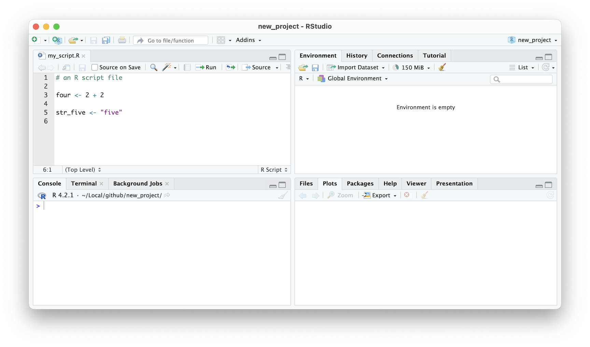

## Rstudio

RStudio, prior to 2023, was an independent software provider for the ever-popular RStudio products, which included both the desktop and server based IDEs, along with the RShiny applications and servers that facilitate easy-to-build interactive web applications straight from R, and deployed on the web. The last chapter in this book will explore the `tidyproteomics` package which also has a Shiny web application. RStudio announced at the beginning of 2023 a soft pivot to Posit, which essentially is a rebranding of the RStudio company to encompass a larger data science audience, one that also provides integration with the Python programming language inside the RStudio IDE.

> The most trusted IDE for open source data science
>
> "RStudio is an integrated development environment (IDE) for R and Python. It includes a console, syntax-highlighting editor that supports direct code execution, and tools for plotting, history, debugging, and workspace management. RStudio is available in open source and commercial editions and runs on the desktop (Windows, Mac, and Linux)."
>
> --- www.posit.co (Jan 2023)

#### Steps {.unnumbered}

1.  Navigate to [posit.co](https://posit.co/), alternatively [rstudio.com](https://rstudio.com/) redirects to the Posit website.
2.  **Click** `Download RStudio` in the menu top right
3.  Select `RStudio Desktop`
4.  **Click** `Download RStudio`\
    *skip 1: Install R*
5.  **Click** `Download RStudio Desktop for ..`

##### Windows OS {.unnumbered}

##### MacOS {.unnumbered}

Opening the .dmg file shows the archive that can be copied into the Applications folder simply by click-dragging the application onto the Applications folder shortcut.

```{r 2011, echo=FALSE, fig.cap="\\label{fig:2011}RStudio IDE Install"}
knitr::include_graphics("images/02_011_rstudio_installer_mac.png")
```

##### Linux {.unnumbered}

### IDE Layout

The RStudio IDE consists of 4 individual panes each containing parts of the total environment, making it more manageable. For instance, having the text editor and console open and organized while creating and viewing a plot is delightfully easier than having three separate applications open on a desktop.

```{r 2021, echo=FALSE, fig.cap="\\label{fig:2021}RStudio IDE in the default layout"}
knitr::include_graphics("images/02_021_rstudio_panes.png")
```

#### The Editor {.unnumbered}

**Tabs**: `All Open Files`\
Basically a text editor, but with the knowledge of R. The *Editor* automatically colors parts of the text based on what it is. Notice in the image below, comments (starting with a hash \#) are a light green, operators (+ and the assignment operator \<-) are a light blue, variables (2 and four) are black and quoted text (called strings) are purple.

```{r 2022, echo=FALSE, fig.cap="\\label{fig:2022}RStudio IDE syntax highlighting"}

```

The *Editor* also has the ability to know what is available to use, such as variables and functions. In the image below, the editor has suggested that I might want to use the `mean()` function for calculating the average of a collection of values and provided a pop up which is selectable - there is even a popup description to accompany it. This occurs after typing in the first three letters of anything, the editor will try to guess what you want next.

```{r 2023, echo=FALSE, fig.cap="\\label{fig:2023}RStudio IDE auto complete"}
knitr::include_graphics("images/02_023_editor_autocomplete.png")
```

#### Files and Plots {.unnumbered}

**Tabs**: `Files` `Plots` `Packages` `Viewer` `Presentation`\
The script that is open in the editor has been saved to the current project, and is visable in the *Files* tab on the top right. Opening another file will open another tab in the *Editor*, allowing you to switch between open files. Also located in this pane is the *Plots* tab where any active plots can be viewed instantly. This is where RStudio begins to shine, with the ability to bring together editing and visualization all in one application.

```{r 2024, echo=FALSE, fig.cap="\\label{fig:2024}RStudio IDE plot window"}
knitr::include_graphics("images/02_024_qplot.png")
```

#### The Console {.unnumbered}

**Tabs**: `Console` `Terminal`, `Background Jobs`\
This is where lines of code will be run from the editor You can also run code here Also gives access to the computer's terminal

#### Environment {.unnumbered}

**Tabs**: `Environment` `History` `Connections` `Tutorial`

### Usage .. Running lines of code in RStudio

#### Run from the editor (recommended)

1.  Type in the code in the Editor (top-left pane)
2.  Put editor cursor anywhere on that line
3.  Press Ctrl/CMD+Enter.
4.  Multiple lines: highlight multiple lines then press Ctrl/CMD+Enter \#### Run from the onsole (occasionally)
5.  Type code into Console (bottom-left) after the '\>'
6.  Press Enter.
7.  Multiple lines, not advised, but copy and paste multiple lines into console then press Enter.
