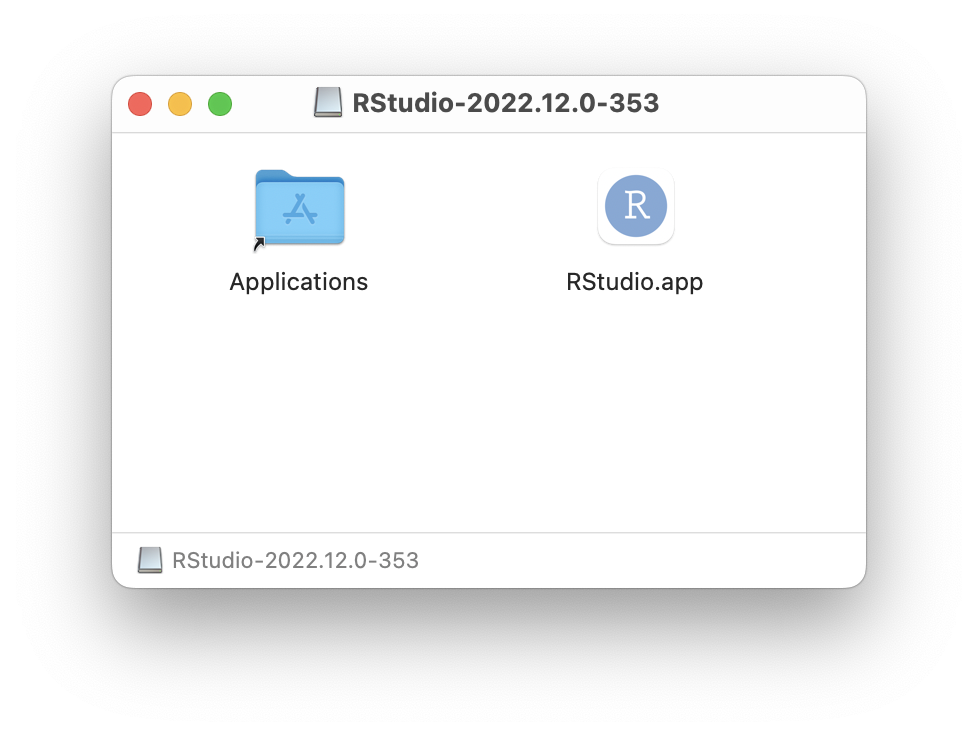
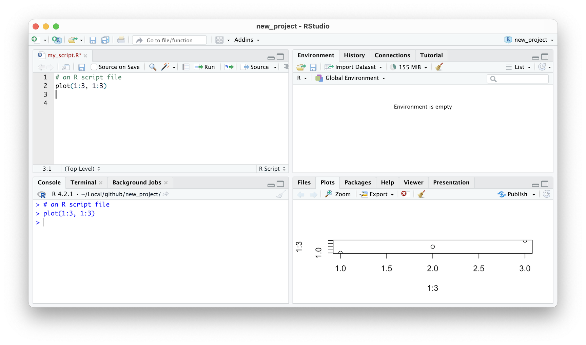

## Rstudio

RStudio, prior to 2023, was an independent software provider for the ever-popular RStudio products, which included both the desktop and server based IDEs, along with the RShiny applications and servers that facilitate easy-to-build interactive web applications straight from R, and deployed on the web. The last chapter in this book will explore the `tidyproteomics` package which also has a Shiny web application. RStudio announced at the beginning of 2023 a soft pivot to Posit, which essentially is a rebranding of the RStudio company to encompass a larger data science audience, one that also provides integration with the Python programming language inside the RStudio IDE.

> The most trusted IDE for open source data science
>
> "RStudio is an integrated development environment (IDE) for R and Python. It includes a console, syntax-highlighting editor that supports direct code execution, and tools for plotting, history, debugging, and workspace management. RStudio is available in open source and commercial editions and runs on the desktop (Windows, Mac, and Linux)."
>
> --- www.posit.co (Jan 2023)

#### Steps {.unnumbered}

1.  Navigate to [posit.co](https://posit.co/), alternatively [rstudio.com](https://rstudio.com/) redirects to the Posit website.
2.  **Click** `Download RStudio` in the menu top right
3.  Select `RStudio Desktop`
4.  **Click** `Download RStudio`\
    *skip 1: Install R*
5.  **Click** `Download RStudio Desktop for ..`

##### Windows OS {.unnumbered}

##### MacOS {.unnumbered}

Opening the .dmg file shows the archive that can be copied into the Applications folder simply by click-dragging the application onto the Applications folder shortcut.

```{r 2011, echo=FALSE, fig.cap="\\label{fig:2011}RStudio IDE Install"}

```

##### Linux {.unnumbered}

### IDE Layout

The RStudio Integrated Development Environment (IDE) is a powerful tool that can make your data analysis and coding tasks more manageable. One of the key features of the RStudio IDE is that it consists of four individual panes, each containing parts of the total environment. This makes it easier for you to navigate your coding and analysis tasks.

For example, while creating and viewing a plot, you can have the text editor and console open and organized. This way, you can easily see how the code you are writing is impacting the plot you are creating. Having everything in one place can also help reduce the clutter on your desktop, as you don't need to have multiple applications open at the same time.

Overall, the RStudio IDE is an excellent option for anyone looking to streamline their coding and data analysis workflows. By taking advantage of its various features, you can make your work more efficient and enjoyable.

```{r 2021, echo=FALSE, fig.cap="\\label{fig:2021}RStudio IDE in the default layout"}
knitr::include_graphics("images/02_021_rstudio_panes.png")
```

#### The Editor {.unnumbered}

> **Tabs**: `All Open Files`

The *Editor* is a tool that allows you to write R code with ease. It is essentially a text editor, but with the added benefit of having knowledge of R. This means that it can automatically color different parts of your code based on their function. This can be a huge time saver, as it makes it easier to read and understand your code.

For example, comments in R code start with a hash (\#) symbol. In the *Editor*, these comments are colored light green, making them easy to spot. Similarly, operators like the plus sign (+) and the assignment operator (\<-) are colored light blue. This makes it easy to identify where these operators are being used in your code.

Variables are an important part of any programming language, and R is no exception. In the *Editor*, variables are colored black. This makes it easy to distinguish variable names from other parts of your code. Finally, quoted text (also known as strings) are colored purple. This makes it easy to identify where strings are being used in your code.

In summary, the *Editor* is a powerful tool that can help you write R code more efficiently. By automatically coloring different parts of your code, it makes it easier to read and understand. Whether you are a beginner or an experienced R programmer, the *Editor* can help you write better code in less time.

```{r 2022, echo=FALSE, fig.cap="\\label{fig:2022}RStudio IDE syntax highlighting"}
knitr::include_graphics("images/02_022_editor_highlighting.png")
```

The Editor also has the ability to suggest available variables and functions. In the image provided, the editor suggests using the mean() function to calculate the average of a collection of values. A pop-up with a description accompanies the suggestion. This feature occurs after typing in the first three letters of anything, and the editor will try to guess what you want to type next. This is a helpful tool that can save you time and effort when writing R code.

```{r 2023, echo=FALSE, fig.cap="\\label{fig:2023}RStudio IDE auto complete"}
knitr::include_graphics("images/02_023_editor_autocomplete.png")
```

#### Files and Plots {.unnumbered}

> **Tabs**: `Files`, `Plots`, `Packages`, `Viewer`, and `Presentation`

When you're working in RStudio, your workflow is made simple with the various tabs and features available. For instance, the script that you're currently working on is saved to the current project and can be accessed via the *Files* tab located on the top right-hand side of the pane. This tab provides an overview of all the files in the working directory, and you can easily navigate between them.

If you need to open another file, you can do so by clicking on the *File* menu or by using the shortcut key. When you open a new file, it will create a new tab in the *Editor* pane, which allows you to switch between open files. This feature is super helpful when you're working on multiple files simultaneously.

Another useful tab located in the same pane is the *Plots* tab. This tab provides a quick way to view any active plots instantly. You don't need to export your plots or save them separately. Instead, you can view them right within RStudio. This is where RStudio truly shines, as it brings together editing and visualization in one application.

```{r 2024, echo=FALSE, fig.cap="\\label{fig:2024}RStudio IDE plot window"}

```

#### The Console {.unnumbered}

> **Tabs**: `Console`, `Terminal`, and `Background Jobs`

In the RStudio IDE, the *Console* pane is where lines of code are executed from the editor. It is a vital component of the RStudio interface that allows users to interact with R in real-time. The *Console* pane is not only where code is run, but it is also where users can view output and error messages. Additionally, the *Console* pane provides users access to the computer's terminal. This feature allows users to execute commands outside of the R environment, such as navigating files and directories or installing packages. Overall, the *Console* pane is an essential tool for any RStudio user and should be utilized to its full potential.

#### Environment {.unnumbered}

> **Tabs**: `Environment`, `History`, `Connections`, and `Tutorial`

When you're working on a project in R, it's essential to keep track of the variables and functions that you're using in your current session. The *Environment* tab, located at the top left of the RStudio interface, provides a concise summary of in-memory variables and functions that were created locally, as opposed to functions that were loaded from a package.

This summary can be useful for new-comers to R because it allows you to quickly see what objects you are currently working with, without having to remember each or manually check. By having a clear overview of your current session, you can avoid mistakes or errors that might arise from using the wrong object or function.

Overall, the *Environment* tab is a helpful feature of RStudio that can save you time and frustration. If you're new to R or just starting to use RStudio, make sure to keep an eye on the *Environment* tab and make use of its features as often as possible. As you become more versed in RStudio this tab may become less relevant.

```{r 2025, echo=FALSE, fig.cap="\\label{fig:2025}RStudio IDE environment window"}

```

### Usage .. Running lines of code in RStudio

#### Run from the editor (recommended)

1.  Type in the code in the Editor (top-left pane)
2.  Put editor cursor anywhere on that line
3.  Press Ctrl/CMD+Enter.
4.  Multiple lines: highlight multiple lines then press Ctrl/CMD+Enter \#### Run from the onsole (occasionally)
5.  Type code into Console (bottom-left) after the '\>'
6.  Press Enter.
7.  Multiple lines, not advised, but copy and paste multiple lines into console then press Enter.
