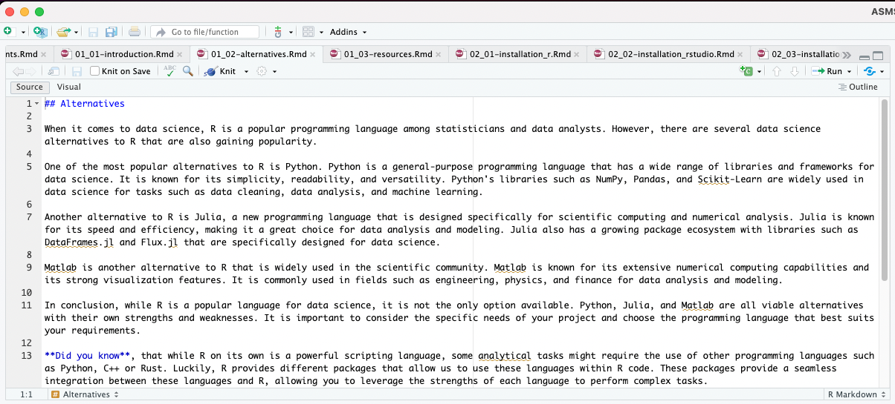
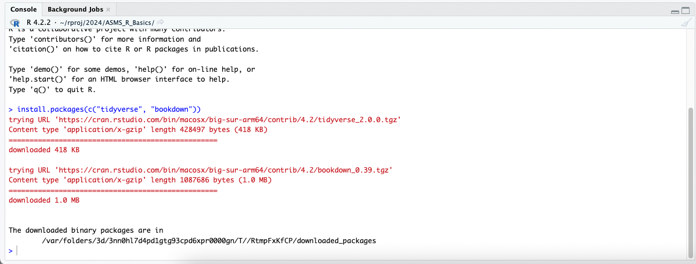
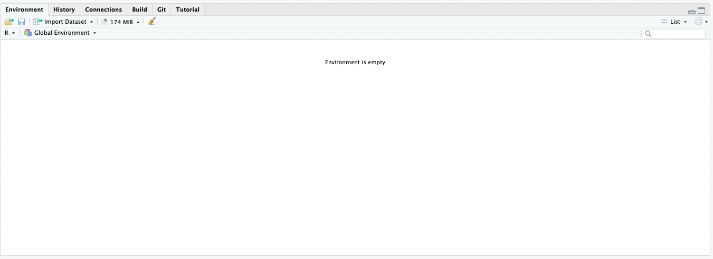
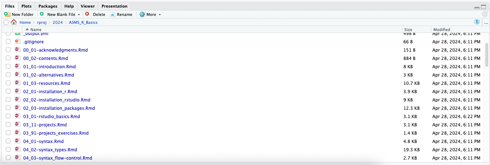

# RStudio Basics 


## R vs R Studo
R and RStudio are related and have become somewhat synonymous because the popular of RStudio for developing R code. However, it is important to understand the difference.

*R*: R is a programming language and software environment specifically designed for statistical computing and graphics. It provides a wide variety of statistical and graphical techniques, including linear and nonlinear modeling, time-series analysis, classification, clustering, and more. R is open-source and is maintained by a community of statisticians and data scientists.

*RStudio*: RStudio, on the other hand, is an integrated development environment (IDE) for R. It provides a user-friendly interface for writing, running, and debugging R code. RStudio offers features like syntax highlighting, code completion, built-in plotting, debugging tools, and package management. It also includes features for managing projects, organizing files, and integrating with version control systems like Git.

In essence, R is the language itself, while RStudio is a tool that makes working with R more efficient and convenient by providing an intuitive interface and additional features for development and analysis.

## RStudio Basic Interactions

*Script Editor*: The central pane is the script editor, where you can write and edit your R code. This is where you'll spend most of your time writing your scripts, functions, and analyses.
```{r 3000, echo=FALSE, fig.align='center'}

```

*Console*: The bottom-left pane is the console, which is where R code is executed. You can directly type commands into the console and see the results immediately. It's also where error messages and warnings are displayed.

```{r 3001, echo=FALSE, fig.align='center'}

```

*Environment/History*: The top-right pane typically displays your current R environment, including objects (variables, data frames, functions, etc.) that are currently loaded into memory. It also shows your command history.

```{r 3002, echo=FALSE, fig.align='center'}

```

*File Viewer/Plots/Packages/Help*: The bottom-right pane is a multi-functional pane that can display various tabs such as Files (for navigating your file system), Plots (for displaying plots generated by R), Packages (for managing installed R packages), and Help (for accessing documentation and help files).

```{r 3003, echo=FALSE, fig.align='center'}

```

### Other Areas
*Toolbar*: The toolbar at the top provides quick access to common actions such as saving scripts, running code, debugging, and accessing project-related functions.

*Tabs and Panes*: RStudio allows you to customize the layout by rearranging or closing panes and tabs according to your preferences. You can also split panes horizontally or vertically to view multiple files or outputs simultaneously.

*Project Management*: RStudio has built-in support for managing projects, which helps organize your work by providing a dedicated workspace with its own working directory, environment, and settings.

These are the basic interactions in RStudio, but as you become more familiar with the environment, you'll discover additional features and functionalities that can enhance your workflow and productivity.

## Hot Keys

To find RStudio hotkeys, you can navigate to the "Tools" menu in RStudio and find `Keyboard Shortcuts Help` (or `alt`+`shift`+`k` or `opt`+`shift`+`k`). You can view and customize the existing keyboard shortcuts with the `Modify Keyboard Shortcuts...` option.

Here are some very important keyboard shortcuts to know:

*   **Run Current Line or Selection**:
    
    *   Windows: Ctrl + Enter
    *   macOS: Command + Enter
*   **Run Current Script**:
    
    *   Windows: Ctrl + Shift + S
    *   macOS: Command + Shift + S
*   **Comment/Uncomment Current Line or Selection**:
    
    *   Windows: Ctrl + Shift + C
    *   macOS: Command + Shift + C
*   **Insert Assignment Operator**:
    
    *   Windows: Alt + -
    *   macOS: Option + -
*   **Clear Console**:
    
    *   Windows: Ctrl + L
    *   macOS: Command + L
*   **Interrupt R Process**:
    
    *   Windows: Ctrl + Break
    *   macOS: Command + Period
*   **Open File**:
    
    *   Windows: Ctrl + O
    *   macOS: Command + O
*   **Save File**:
    
    *   Windows: Ctrl + S
    *   macOS: Command + S
*   **Find**:
    
    *   Windows: Ctrl + F
    *   macOS: Command + F
*   **Close Current Tab**:
    
    *   Windows: Ctrl + W
    *   macOS: Command + W


## Create, Run, Save Scripts

As scripts are the business of RStudio, it is important to know how to deal with them and incorporate them in your developments.

1.  **Creating a New Script**:
    
    *   To create a new script in RStudio, you can go to the "File" menu at the top left corner.
    *   From there, select "New File" and then "R Script."
    *   Alternatively, you can use the shortcut "Ctrl + Shift + N" on Windows or "Command + Shift + N" on macOS to create a new script directly.
  
2.  **Writing and Editing Code**:
    
    *   Once you've opened a new R script, you can start writing your R code in the script editor pane, which is the central pane in RStudio.
    *   You can type or paste your R code directly into this pane. RStudio provides syntax highlighting to make your code more readable.
    *   You can also insert comments in your script using the "#" symbol.

3.  **Running Code**:
    
    *   To run specific lines of code or a selection in your script, you can either:
        *   Place your cursor on the line(s) you want to run and press "Ctrl + Enter" on Windows or "Command + Enter" on macOS.
        *   Select the lines you want to run and then click the "Run" button in the toolbar at the top of the script editor pane.
    *   Alternatively, you can run the entire script by clicking the "Source" button in the toolbar, or by using the shortcut "Ctrl + Shift + S" on Windows or "Command + Shift + S" on macOS.

4.  **Saving Scripts**:
    
    *   To save your script, you can go to the "File" menu and select "Save" or "Save As" to specify a new file name or location.
    *   You can also use the shortcut "Ctrl + S" on Windows or "Command + S" on macOS to quickly save your changes.
    *   RStudio will save your script with a ".R" extension by default.

By following these steps, you can create, run, and save scripts in RStudio efficiently. This workflow is essential for developing and executing R code for data analysis, statistical modeling, and other tasks.

## Running Code

### R Notebooks
Running code as you develop R code can give you immediate feedback about whether the code actually runs, can also  `print` something to the console that is useful in understanding your data analysis, or can generate new data objects for other acts.

Running R code in RStudio can be done in three main ways: line-by-line execution, running a block of lines, or executing an entire script.

1.  **Line-by-Line Execution**:
    
    *   In RStudio, you can execute R code line-by-line by placing your cursor on the line you want to run and then pressing "Ctrl + Enter" (Windows) or "Command + Enter" (Mac).
    *   This method is useful for debugging or testing small sections of code, as you can see the output or any errors generated by each line immediately.
2.  **Running a Block of Lines**:
    
    *   If you want to execute a block of consecutive lines, you can select the lines you want to run in the script editor.
    *   After selecting the lines, you can press "Ctrl + Enter" (Windows) or "Command + Enter" (Mac) to execute the entire selected block at once.
    *   This method is convenient when you want to test or run a specific section of your code without executing the entire script.
3.  **Running an Entire Script**:
    
    *   To execute an entire R script in RStudio, you have a couple of options:
        *   You can click the "Source" button in the toolbar at the top of the script editor pane.
        *   Alternatively, you can use the keyboard shortcut "Ctrl + Shift + S" (Windows) or "Command + Shift + S" (Mac) to run the entire script.
    *   Running the entire script is useful when you want to execute all the code in your script file, such as when reproducing an analysis or generating final results.

By utilizing these methods, you can effectively run R code in RStudio, whether it's for debugging, testing, or executing complete scripts for data analysis or other tasks. Each method offers flexibility and efficiency in different scenarios, depending on your workflow and needs.

## R Notebooks vs R scripts

### R Notebooks
Notebooks are a great way that has come to prominence in recent years to develop R or other language code.

R Notebooks are a powerful tool in RStudio that allow you to combine narrative text, code, and the output of that code (such as plots or tables) into a single, interactive document. They are particularly useful for reproducible research, data analysis, and sharing insights with others. Here's a breakdown of their use:

1.  **Creating an R Notebook**:
    
    *   To create a new R Notebook in RStudio, you can go to the "File" menu, choose "New File," and then select "R Notebook."
    *   Alternatively, you can use the keyboard shortcut "Ctrl + Shift + N" (Windows) or "Command + Shift + N" (Mac) and choose "R Notebook."
2.  **Structure of an R Notebook**:
    
    *   R Notebooks have a similar structure to R scripts, with the addition of Markdown cells for narrative text.
    *   Markdown cells allow you to write formatted text, including headings, lists, links, and more, using simple syntax.
    *   You can intersperse Markdown cells with code chunks, where you write and execute R code.
3.  **Writing Narrative Text**:
    
    *   Markdown cells in R Notebooks are where you can provide explanations, interpretations, and context for your analysis.
    *   You can use Markdown syntax to format text, create headings, include images, and even write mathematical equations using LaTeX syntax.
4.  **Writing and Executing R Code**:
    
    *   Code chunks in R Notebooks are denoted by three backticks followed by "r" in curly braces: `{r}`.
    *   Within code chunks, you can write and execute R code just like you would in a regular R script.
    *   Code chunks can be run individually or all at once, and the output (such as plots, tables, or printed results) is displayed directly below each code chunk.
5.  **Reproducibility**:
    
    *   R Notebooks promote reproducibility by capturing both the code and its output in a single document.
    *   Others can easily reproduce your analysis by running the notebook, ensuring transparency and accountability in research and data analysis.
6.  **Exporting and Sharing**:
    
    *   R Notebooks can be exported to various formats, including HTML, PDF, and Word, allowing you to share your work with collaborators or stakeholders.
    *   You can also publish R Notebooks directly to platforms like RStudio Connect or R Markdown websites for broader dissemination.

Overall, R Notebooks provide a seamless way to integrate code, text, and output in a single document, facilitating reproducible research and effective communication of data analysis findings. They are a valuable tool for anyone working with R for data analysis, research, or reporting.


### R Scripts

R scripts by contrast are JUST CODE elements where descriptive text can be added as comments.

Comments are added with at least 1 `#` before code like below.

```{r, eval=FALSE}
# comments go like this
# do a basic addition
2 + 2
```


