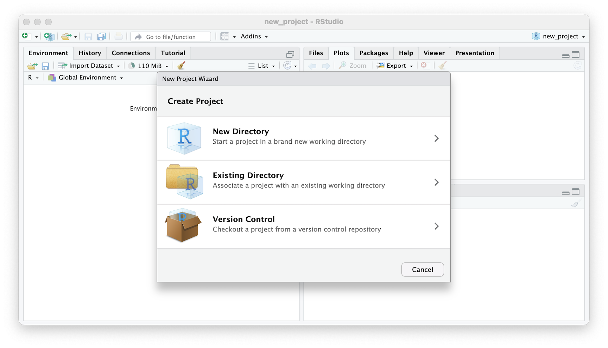

## Projects
Project are how RStudio organizes your work. Think of project as singular goal oriented collection. There are no rules but some basic organizational tips should help simplify your project.

### Creating
Creating a new project is very forgiving, you can create a new directory with a project name, or create a project out of an existing directory. 
  
Either 
1. Click on the drop down in the top right
2. OR: Under the menu item select `File > New Project`

In the `New Project Wizard` select `New Directory > New Project`, enter the name of the project and click `Create Project`.

```{r 3201, echo=FALSE, fig.cap="\\label{fig:3201}RStudio Create New Project"}

```

### Editing 


### Organizing


#### Data

#### Scripts

#### Results

##### Tables

##### Plots


