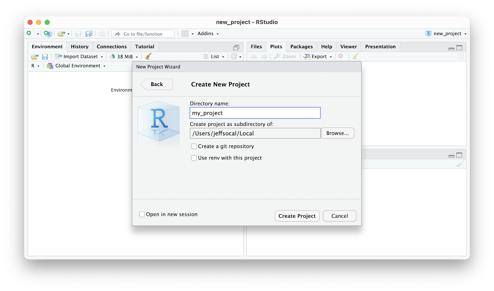
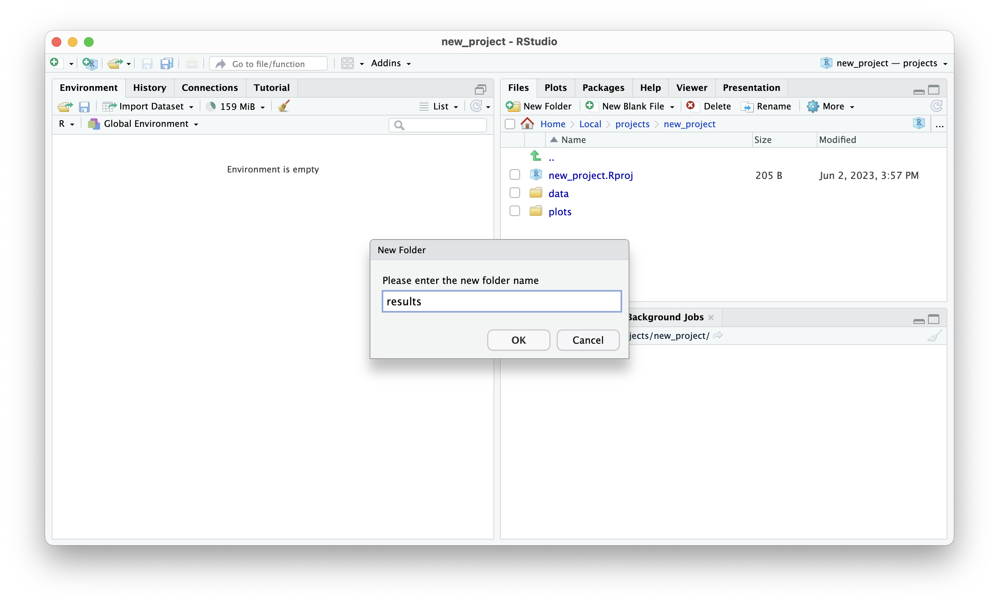

# R Studio Projects

Project are how RStudio organizes your work. Think of project as singular goal oriented collection. There are no rules but some basic organizational tips should help simplify your project.

## Creating

Creating a new project is very forgiving, you can create a new directory with a project name, or create a project out of an existing directory.

Either 1. Click on the drop down in the top right 2. OR: Under the menu item select `File > New Project`

In the `New Project Wizard` select `New Directory > New Project`, enter the name of the project and click `Create Project`.

```{r 3201, echo=FALSE, fig.cap="\\label{fig:3201}RStudio Create New Project"}
knitr::include_graphics("images/03_021_new_project_01.png")
```
```{r 3202, echo=FALSE, fig.cap="\\label{fig:3202}RStudio Create New Project"}

```

## Organizing
Organizing your RStudio project is an important task that can help you work more efficiently and avoid confusion when working on a project. Good organization will help you come back to your code at a later date as well as make it possible in some smaller projects to share entirely the data and code, making it possible for others to run the code and modify it.

#### Data

It's a good idea to keep your data files separate from your R scripts and other files. If the data is small enough (at your disgression what is small), it can be helpful to store the data in `/data/` folder in the project itself!

You can then also use subfolders to organize different types of data or data from different sources with the `/data/` folder.

You can create and navigate folders in your RStudio project directly in RStudio!
```{r 3201, echo=FALSE, fig.cap="\\label{fig:3203}RStudio Create New Folder"}

```

#### Scripts
One of the best ways to manage scripts is tocreate scripts for different tasks: Break your project into separate scripts that perform different tasks, such as data cleaning, data analysis, and data visualization. This can make it easier to modify and update specific parts of your project without affecting other parts.

#### Results
Like data, results may be best saved in a specific results folder. Keeping track of date and time of results can also be smart.

##### Tables
Tables can be exported as .csv or other formats depending on your use case and stored in results. Always keep track of date and time the results were created. One issue that can arise is a new version of the result was created by a new process in the code but that is not indicated in the file name, so it is hard to be certain the results are the latest.  

##### Plots
Similar to tables, plot files could be stored in a sub folder. 
