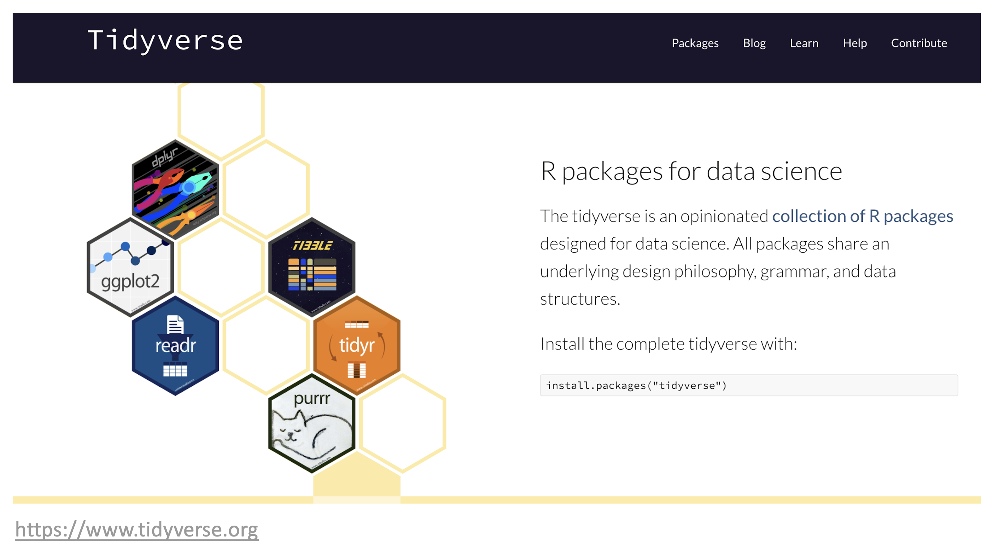
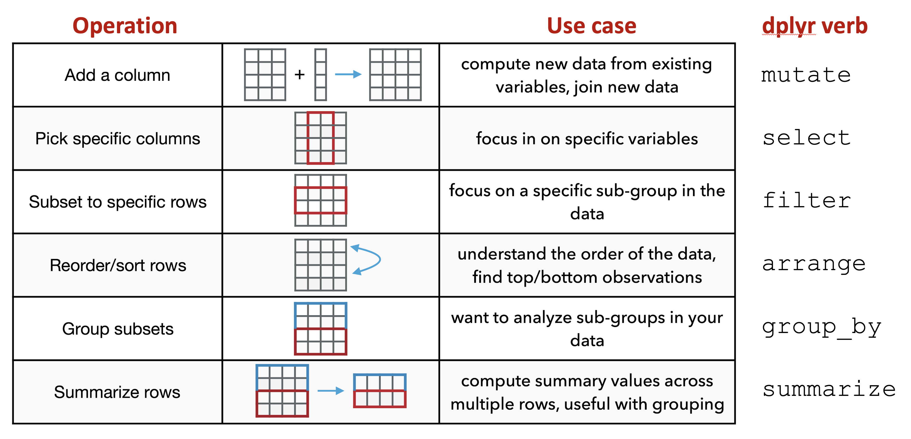
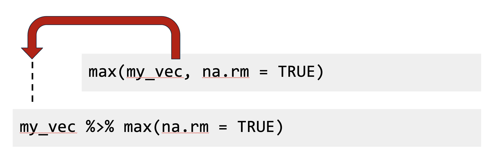
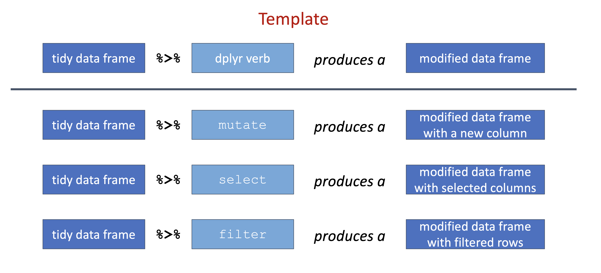
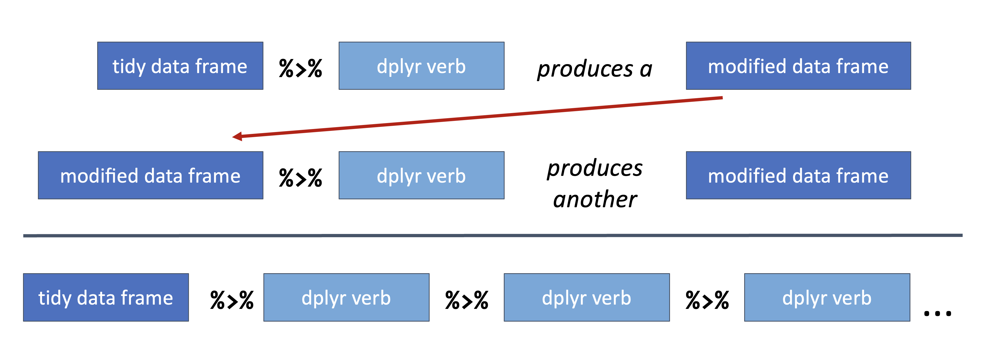

# Tidyverse

The `tidyverse` is actually a collection of R packages designed for data analysis and visualization. It is an essential tool for data scientists and statisticians who work with large datasets.

\

+---------------------------------+-----------------------------------------------------------+
| {height="68"} | **At the end of this chapter you should be able to**      |
|                                 |                                                           |
|                                 | -   Grasp the utility of the tidyverse.                   |
|                                 |                                                           |
|                                 | -   Understand how to construct a data pipeline.          |
|                                 |                                                           |
|                                 | -   Composed a simple workflow.                           |
+---------------------------------+-----------------------------------------------------------+

\

```{r 6001, echo=FALSE, fig.cap="\\label{fig:6001}The tidyverse.", fig.align='center'}

```


The `tidyverse` packages are built around a common philosophy of data manipulation. The goal is to provide a consistent and intuitive syntax for data analysis that is easy to learn and use. The packages in the `tidyverse` include:

+------------------------------+-------------------------------------------------------+
| \@ref(magrittr) magrittr     | provides the pipe, %>% used throughout the tidyverse. |
+------------------------------+-------------------------------------------------------+
| \@ref(tibble) tibble         | creates the main data object.                         |
+------------------------------+-------------------------------------------------------+
| \@ref(readr) readr           | reading and writing data in various formats.          |
+------------------------------+-------------------------------------------------------+
| \@ref(dplyr) dplyr           | data manipulation.                                    |
+------------------------------+-------------------------------------------------------+
| \@ref(tidyr) tidyr           | transforming messy data into a tidy format.           |
+------------------------------+-------------------------------------------------------+
| \@ref(purrr) purrr           | functional programming with vectors and lists.        |
+------------------------------+-------------------------------------------------------+
| \@ref(stringr) stringr       | working with strings.                                 |
+------------------------------+-------------------------------------------------------+
| \@ref(lubridate) lubridate   | working with dates and date strings.                  |
+------------------------------+-------------------------------------------------------+
| \@ref(ggplot2) ggplot2       | graphical plotting and data visualization.            |
+------------------------------+-------------------------------------------------------+

These packages work seamlessly together, allowing users to easily manipulate and visualize their data. The `tidyverse` also includes a set of conventions and best practices for data analysis, making it easy to follow a consistent workflow.

\

+---------------------------------+-----------------------------------------------------------+
| {height="68"} | **Cheat-sheets** \@ref(cheat-sheets)                      |
+---------------------------------+-----------------------------------------------------------+

\

Consider the following workflow to read in data, calculate a linear regression and visualize the data using nine (9) of the underlying packages in the tidyverse. In this example, the goal is to read in climate data from Denver, Colorado and create a linear model relating the monthly amount of snowfall to the minimum temperature computed separately for each year in the data set.  Additionally, plots of the data and the linear fit are produced to visualize the data.

```{r, message=FALSE, warning=FALSE, fig.width=6, fig.height=4, fig.align='center'}
library(tidyverse)

# readr, tibble: read in a table of comma separate values
tbl_csv <- read_csv("data/denver_climate.csv")

# define a function to fit a linear regression model
lm_func <- function(data) {
  lm(snowfall ~ min_temp, data = data)
}

# readr, tibble, magrittr: using the data imported from above
tbl_csv_lm <- tbl_csv %>%
  # dplyr
  group_by(year) %>%
  # tidyr
  nest() %>%
  # dplyr, purrr: apply the function to each nested data frame
  mutate(model = map(data, lm_func)) %>%
  # dplyr, broom, purrr: extract the coefficients from each model
  mutate(tidy = map(model, broom::tidy)) %>%
  # tidyr
  unnest(tidy) %>%
  ungroup() %>%
  # dplyr, stringr: clean-up the terms
  mutate(term = term %>% str_replace_all("\\(|\\)", "")) %>%
  # dplyr: retain only specific columns
  select(year, term, estimate) %>%
  # tidyr: convert from a long table to a wide table
  pivot_wider(names_from = 'term', values_from = 'estimate') %>%
  # dplyr: rename the min_temp variable to slope
  rename(model_slope = min_temp)


#ggplot2
ggplot(tbl_csv, aes(min_temp, snowfall)) + 
  # represent the data as points
  geom_point() +
  # use the linear model data to plot regression lines
  geom_abline(data = tbl_csv_lm,
              aes(slope = model_slope, intercept = Intercept)) +
  # plot each year separately 
  facet_wrap(~year)
  

```

To get started with the `tidyverse`, you can install the package using the following command:

```{r, eval=FALSE}
install.packages("tidyverse")
```

Once installed, users can load the package and begin using the individual packages within the tidyverse:

```{r, eval=FALSE}
library(tidyverse)
```

Overall, the tidyverse is an essential tool for data analysis and visualization in R. Its user-friendly syntax and consistent conventions make it easy for data scientists and statisticians to work with large datasets.

## Core Packages
Two important packages in the tidyverse are tibble and magrittr. These core packages enable other data manipulation operations to work seamlessly, improving efficiency and ease of use when working with data in R. In practice, these packages are typically used "behind-the-scenes": you may not realize you're using them, but they provide the basis for working with data in the tidyverse.

### magrittr
The tidyverse package `magrittr` is a popular R package that provides a set of operators for chaining operations in a sequence, or *pipeline*. The package was developed by Stefan Milton Bache and Hadley Wickham. The main goal of `magrittr` is to make code more readable and easier to maintain by providing a chaining mechanism to link together individual data manipulation operations into data analysis pipelines. These pipelines are often much easier to construct and read compared to the same code written with base R.

The pipe operator, `%>%`, is the most famous operator provided by `magrittr.` It allows you to chain multiple operations without the need to use intermediate variables. The pipe operator takes an input, which could be the output of a previous function, and passes it as the first argument to the next function. This chaining of operations allows for more concise and readable code.


Here is an example of how to use the pipe operator with `magrittr`:

```{r, eval=TRUE}
# create a vector of numbers
numbers <- c(1, 2, 3, 4, 5)

# Compute the square root of the sum of the numbers
# using base R
sqrt(sum(numbers))

# use the pipe operator to do the same thing
# by chaining together the operations
numbers %>% sum() %>% sqrt()

```

In this example, we create a vector of numbers and use the pipe operator to chain the `sum()` and `sqrt()` functions. The output of the `sum()` function is passed as the first argument to the `sqrt()` function. In this case, the base R version is actually quicker to type, but the order of operations are specified "inside-out" which is backwards from how we typically read. An advantage of pipe syntax is that the steps of the data processing proceed from left-to-right, just like how we read standard text. This become particularly helpful when performing more complex data analyses.

Magrittr also provides other useful operators, such as the assignment pipe `%<>%`, which allows you to update a variable in place, and the tee operator `%T>%`, which allows you to inspect the output of an operation without interrupting the chain.

+---------------------------------+-------------------------------------------------------------------------------------------------------------------------------------+
| {height="68"} | **The New Pipe Operator**: The R language has recently added a "native" pipe operator, `|>`, that is part of base R. Newer R code   |
|                                 |                            may use `|>` instead of `%>%` but both do *essentially* the same thing.                                  |
|                                 |                            see [this blog post](https://www.tidyverse.org/blog/2023/04/base-vs-magrittr-pipe/) for more information |
+---------------------------------+-------------------------------------------------------------------------------------------------------------------------------------+

### tibble
R `tibble` is a class of data frame in the R programming language. It is an improved alternative to the traditional data frame and is part of the tidyverse package. Tibbles are data frames with stricter requirements, and they provide a streamlined and more efficient way to work with data.

One of the main advantages of tibbles is that they provide a cleaner and more consistent way to display data. Tibbles only show the first 10 rows and all the columns that fit on the screen, making it easier to work with large datasets. Additionally, tibbles automatically convert character vectors to factors, preventing common errors that can occur when working with data frames.

Another important feature of tibbles is the way they handle column names. Tibbles will not allow spaces in column names, and they use backticks to reference columns with non-standard names. This makes it easier to work with datasets that have complex column names. Tibbles also provide a more consistent way to handle missing values. In data frames, missing values can be represented in different ways, such as NA, NaN, or NULL. Tibbles, on the other hand, only use NA to represent missing values, making it easier to work with missing data.

## Importing
### readr
R `readr` is a package in the R language that is used to read structured data files into R. The package is an efficient and user-friendly toolkit that allows for the reading of different types of flat files such as CSV, TSV, and fixed-width files. It is part of the tidyverse collection of packages, which is popular among data scientists and statisticians.

One of the key features of `readr` is its ability to quickly read data into R, making it an ideal package for data analysis and data cleaning. `readr` is designed to handle various types of data, including numeric, date, and character data. The package also has advanced features such as automatic guessing of column types, encoding detection, and parsing of dates and times.

```{r, eval=FALSE, message=FALSE, warning=FALSE}
# read comma separated values
tbl_csv <- "data/bacterial-metabolites_dose-simicillin_tidy.csv" %>% read_csv()
```

One of the best things about `readr` is its consistency in dealing with file formats, which allows for easy and fast data manipulation. The package provides a high level of control over the import process, allowing you to specify the location of the data file, the delimiter, and the encoding type. Additionally, `readr` can handle large datasets with ease, making it one of the most efficient packages for data handling.

## Wrangling

Data wrangling is the process of cleaning, transforming, and formatting raw data into a usable format for analysis. The steps involved in data wrangling include removing duplicates, dealing with missing or erroneous values, converting data types, and formatting data into a consistent structure. It also involves merging data from different sources, reshaping data, and transforming data for analysis.

The objective of data wrangling is to create high-quality, structured data for further analysis and modeling. It requires technical skills, domain knowledge, and creativity. Without proper data wrangling, analysis and modeling may be compromised, leading to incorrect conclusions and decisions. This is where `tidyverse` functions become quite useful and we will go deeper into Data Wrangling in the subsiquent chapter.

Given an example of wide data, where *Arabidopsis thaliana* plants are measured for height for three weeks post germination.
```{r, message=FALSE, warning=FALSE}
library(tidyverse)

tbl_wide <- tibble(
  plant = LETTERS[1:3],
  condition = c('wet, cold', 'moist, cold', 'moist, hot'),
  week_1 = c(0.3,0.2,0.4),
  week_2 = c(1.3,1.5,1.7),
  week_3 = c(3.4,4.1,5.2)
)

tbl_wide
```


### dplyr
R `dplyr` is perhaps pne of the most powerful libraries in the `tidyverse`, providing a set of tools for data manipulation and transformation. It is designed to work seamlessly with data stored in data frames.

The library comes with a set of functions that can be used to filter, arrange, group, mutate, and summarize data. These functions are optimized for speed and memory efficiency, allowing users to work with large datasets easily.

Some of the most commonly used functions in `dplyr` are:

- **filter**: used to extract specific rows from a data frame based on certain conditions.

```{r}
tbl_wide %>% filter(plant == 'A')
```

- **arrange**: used to sort the rows of a data frame based on one or more columns.

```{r}
tbl_wide %>% arrange(week_3)
```

- **select**: used to select specific columns from a data frame.

```{r}
tbl_wide %>% select(plant, week_3)
```

- **mutate**: used to add new columns to a data frame.

```{r}
tbl_wide %>% mutate(week_4 = c(3.8, 4.6, 5.7))
```

### tidyr
R `tidyr` is a package in R that helps to reshape data frames. It is an essential tool for data cleaning and analysis. Tidyr is used to convert data from wide to long format and vice versa, and it also helps to separate and unite columns.

- **pivot_longer**: used to reshape data from a column-based wide format to a row-based long format.

```{r}
tbl_long <- tbl_wide %>% pivot_longer(cols = matches('week'), names_to = 'time', values_to = 'inches')

tbl_long
```

- **pivot_wider**: used to reshape data from a row-based long format to a column-based wide format.

```{r}
tbl_long %>% pivot_wider(names_from = 'time', values_from = 'inches')
```

The package `tidyr` also has functions to separate and unite columns. The "separate" function is used when you have a column that contains multiple variables. For example, if you have a column that contains both the first and last name of a person, you can separate them into two columns. The "unite" function is the opposite of separate. It is used when you want to combine two or more columns into one column.

- **separate**: used to separate a column with multiple values into two or more columns.

```{r}
tbl_long %>% separate(condition, into = c('soil', 'temp'))
```

- **separate_rows**: used to duplicate a row with multiple values from a given column.

```{r}
tbl_wide %>% separate_rows(condition, sep = ', ')
```

### purrr
The `purrr` package is a functional programming toolkit for R that enables users to easily and rapidly apply a function to a set of inputs, returning a list or vector of outputs. It is designed to work seamlessly with the tidyverse ecosystem of packages, but can also be used with base R functions.

The most important feature in `purrr` is its ability to replace loops with functions that save time and effort. The package has a collection of functions that allow you to work with functions that take one or more arguments. Some of these functions include `map`, `map2`, `pmap`, and `imap.`

The map function is purrr's flagship function and is used to apply a function to each element of a list or vector, returning a list of outputs. The `map2` function applies a function to two lists or vectors in parallel, returning a list of outputs. The `pmap` function applies a function to an arbitrary number of lists or vectors in parallel, returning a list of outputs. The `imap` function is similar to map, but also provides the index of the current element in the input vector.

Purrr also includes features such as the possibility of mapping over nested lists, using `map` and variants to iterate over grouped data, and using `map` and variants to modify data in place.

```{r}
numbers <- list(1, 2, 3, 4, 5)

# define a function to square a number
square <- function(x) { x ^ 2 }

# use map to apply the function to each element of the list
squared_numbers <- map(numbers, square)

# print the result
squared_numbers
```

### glue
R `glue` is a tidyverse package that provides a simple way to interpolate values into strings. It allows users to combine multiple strings or variables together into a single string with minimum efforts, simpler than using base R fuctions.

The `glue` function can handle various types of inputs, including vectors, lists, and expressions. It also supports user-defined formats and allows users to specify separators between the values.

One of the significant advantages of using `glue` is that it provides a more readable and concise way to create strings in R. It eliminates the need for multiple `paste()` or `paste0()` statements, which can be cumbersome and error-prone.

For example, instead of writing:

```{r, eval=FALSE}
paste0("The value of x is: ", x, ", and the value of y is: ", y)
```

we can use R glue:

```{r, eval=FALSE}
glue("The value of x is: {x}, and the value of y is: {y}")
```

This code will produce the same output, but it's more readable and easier to modify.

## Data Types
### stringr
The tidyverse package `stringr`  provides a cohesive set of functions designed to make working with strings more efficient. It is especially useful when dealing with messy or unstructured data that needs to be cleaned and transformed into a more structured format.

Several functions in `stringr` provides methods working with strings, for example:

- **str_replace**: replaces a pattern with another pattern in a string.
```{r}
str_replace("Hello World", "W.+", "Everyone")
```
- **str_extract**: extracts the first occurrence of a pattern from a string.
```{r}
str_extract("Hello World", "W.+")
```
- **str_split**: splits a string into pieces based on a specified pattern.
```{r}
str_split("Hello World", "\\s")
```

### lubridate
The tidyverse package `lubridate` helps with the handling of dates and times. The package has several functions that make it easier to work with dates and times, especially when dealing with data that has different formats.

Some of the functions in `lubridate` package include:

- **ymd** - this is used to convert dates in the format of year, month, and day to the date format in R. For example, `ymd("20220101")` will return the date in R format.
- **dmy** - this is used to convert dates in the format of day, month, and year to the date format in R. For example, `dmy("01-01-2022")` will return the date in R format.
- **hms** - this is used to convert time in the format of hours, minutes, and seconds to the time format in R. For example, `hms("12:30:15")` will return the time in R format.
- **ymd_hms** - this is used to convert dates and times in the format of year, month, day, hours, minutes, and seconds to the date and time format in R. For example, `ymd_hms("2022-01-01 12:30:15")` will return the date and time in R format.

There are also functions for extracting information from dates and times such as `year()`, `month()`, `day()`, `hour()`, `minute()`, and `second()`.

### forcats
R `forcats` is a tidyverse package that provides a set of tools for working with categorical data. It is designed to make it easier to work with factors in R, which are used to represent categorical data.

The `forcats` package provides several functions that can be used to manipulate factors, including reordering levels, combining levels, and handling missing values. It also provides functions for working with ordered factors, which are used to represent data that has a natural ordering, such as age groups or ratings.

One of the key benefits of using `forcats` is that it allows you to easily visualize and analyze categorical data. The package provides functions for creating categorical plots, such as bar charts and pie charts, as well as for calculating summary statistics for categorical data.

In addition to its core functionality, `forcats` is also highly customizable. It provides a wide range of options for controlling the appearance of plots and for customizing the behavior of factor manipulation functions.

## Summarizing
### dplyr
In the R tidyverse package, summarizing data is a common task performed on data frames. The dplyr package provides a set of functions that makes it easy to summarize data based on one or more variables.

- **group_by**: used to group rows of a data frame by one or more columns.
- **summarize**: used to summarize the data based on one or more aggregate functions.

The summarise() function is used to perform simple summary statistics on data frames. It takes the name of the new variable as well as the summary function that should be used to calculate its value. For example, to calculate the mean and standard deviation of a variable named 'x' in a data frame named 'df', we can use the following code:

``` {r}
tbl_long %>%
  summarise(min = min(inches), 
            max = max(inches))
```

The group_by() function is used to group data frames by one or more variables. This is useful when we want to summarize data by different categories. For example, to calculate the mean and standard deviation of 'x' by 'group', we can use the following code:

```{r}
tbl_long %>%
  group_by(plant) %>%
  summarise(min = min(inches), 
            max = max(inches))
```

The summarize_at() and summarize_all() functions are used to perform summary statistics on multiple variables at once. The summarize_at() function takes a list of variables to summarize, while the summarize_all() function summarizes all variables in the data frame. For example, to calculate the mean and standard deviation of all numeric variables in a data frame named 'df', we can use the following code:

```{r}
tbl_long %>%
  summarise_all(list(max = max, min = min))
```

Summarizing data is an essential task that can be performed using several functions. These functions make it easy to calculate summary statistics based on one or more variables, group data frames by different categories, and summarize multiple variables at once.

### ggplot2
The tidyverse package `ggplot2`, demonstrated at the onset of this chapter, is a data visualization package in R programming language that provides a flexible and powerful framework for creating graphs and charts. It is built on the grammar of graphics, which is a systematic way of mapping data to visual elements like points, lines, and bars.

With `ggplot2`, you can create a wide range of graphs including scatterplots, bar charts, line charts, and more. The package offers a variety of customization options, such as color schemes, themes, and annotations, allowing you to create professional-looking visualizations with ease.

One of the key benefits of `ggplot2` is that it allows you to quickly explore and analyze your data visually. You can easily create multiple graphs with different variables and subsets of your data, and compare them side by side to identify patterns and trends.


## Dplyr in more Detail

```{r 6003, echo=FALSE, fig.cap="\\label{fig:6003}dplyr hex logo.", fig.align='center', out.width="40%"}
knitr::include_graphics("images/06_003_dplyr_logo.png")
```

The `dplyr` package is the backbone of the tidyverse and defines the fundamental data operations that are needed to perform data analysis tasks. Specifically, `dplyr` formalizes these fundamental operations into a set of "verbs" or *actions* that are used to manipulate/transform/summarize data.  These verbs are embodied as functions you can use to perform complex data analysis tasks.  Fortunately, there is a relatively small set of functions that you need to learn and remember, and their names clearly reflect what they are used for. Ultimately, these `dplyr` functions help you focus on the question you're trying to answer rather than the mechanism of how to answer the question.

There are six fundamental verbs (functions) provided by the `dplyr` package:

- `mutate`: adds a new (or updates an existing) column to the input data, often based upon exisiting columns in the input data
- `select`: picks specific columns from the input data (i.e. filters to specific columns)
- `filter`: subsets the input data to specific rows, usually based upon a filtering condition
- `arrange`: reorders the input data based upon the data in specified columns
- `group_by`: creates subset groups of the input data using columns with group information in the input data
- `summarize`: compute summaries across multiple rows in your data; often used with `group_by`

```{r 6004, echo=FALSE, fig.cap="\\label{fig:6004}Overview of dplyr verbs.", fig.align='center'}

```

Importantly, the first input to a `dplyr` function is *always* a data table (e.g. a tibble) and the ouput is *always* a new data table that has been transformed by the function. For example:

```{r, eval=FALSE}
# add a new column to my_df
mutate(my_df, ...)

# subset my_df to specific columns
select(my_df, ...)

# dplyr functions always return a transformed data table
# you typically want to save the results to a new variable
# or update the existing version of the table
my_df2 <- mutate(my_df, ...)

```

### `mutate`

The `mutate` function is used when you want to add a new column or update an existing column in your data table. Typically, the new or updated column is based upon existing data already present in your data table and you use it as the basis for the new column you want to create/update. Some examples include:

- computing the log transformed version of existing data
- adding together the values from multiple columns
- subtracting off a baseline value from existing measurements

The following code provides a common example of how `mutate` can be used:

```{r, eval = TRUE}
# mutate example

# Read the data set
dat <- read_csv("data/bacterial-metabolites_dose-simicillin_tidy.csv")
dat

# Add a new column that is the log10 value of the Abundance column
dat <- mutate(dat, log10_Abundance = log10(Abundance))
dat
```

In this example, `dat` is data table and used as input to the `mutate` function. Inside the `mutate` function, the new column to create is given a name, `log10_Abundance`, followed by an `=` and the expression that will be used to compute the data in the new column.  Importantly, this expression uses existing data in our input data table specified by its column name, `Abundance`. Note that there are no quotation marks around `Abundance`; when using `dplyr` functions, you don't put quotes around the name of columns in the input data.


### `select`

The `select` function is used when you want to focus on specific columns in your data table. Sometimes, a data table may contain many columns of data, but you may only need a small subset of them for a given analysis task. In this case, using select removes the unnecessary columns from the data table and allows you to more easily focus on what you need.


```{r, eval = TRUE}
# select example

# Read the data set
dat <- read_csv("data/bacterial-metabolites_dose-simicillin_tidy.csv")
dat

# Focus on just the Organism, Time_min and Abundance columns
dat <- select(dat, Organism, Time_min, Abundance)
dat
```

Here, the `select` function just takes the names of the columns you want to subset to as input. Like in the `mutate` example above, you do not put quotes around the names of the columns.


### `filter`

The `filter` function is used when you need to get or remove specific rows from your data table, almost always as specified by a conditional expression. The `filter` function uses the supplied condition expression, evaluates the condition on each row in your data table, and only gives back rows for which the condition is true.  Keeping versus removing rows depends on how the conditional expression is constructed. For example, if you want to keep rows based on a given condition, you might use the `==` operator, while if you want to remove rows, you might use the `!=` operator. Some examples where `filter` is used include:

- removing negative or missing values (`NA`) from your data table
- getting only the "disease" samples from your data table
- subsetting the data to m/z values greater than 1000


```{r, eval = TRUE}
# filter examples

# Read the data set
dat <- read_csv("data/bacterial-metabolites_dose-simicillin_tidy.csv")
dat

# Get just the e coli data
dat2 <- filter(dat, Organism == "e coli")
dat2

# Remove any data where the Abundance is less than 10
dat2 <- filter(dat, Abundance >= 10)
dat2
```

In the first example, we use the conditional expression `Organism == "e coli"` as the filtering criteria.  Here, `Organism` in the name of a column in our input data (note: no quotes around the column name) and the conditional expression asks the question "is Organism equal to 'e coli'?" for every row in the data table. If the answer is yes, that row is kept in the output; otherwise it is removed. The second example is similar but uses the `>=` operator to ask questions about the `Abundance` values, only keeping those rows where the `Abundance` is greater than or equal to 10.


### `arrange`

The `arrange` function is used to reorder the rows in your data table, most often, by sorting based upon one or more of the columns. Some examples include:

- sorting your table from low to high values
- sorting your table first by a group column, then by values within each group


```{r, eval = TRUE}
# arrange examples

# Read the data set
dat <- read_csv("data/bacterial-metabolites_dose-simicillin_tidy.csv")
dat

# sort the table by Abundance (low to high)
dat <- arrange(dat, Abundance)
dat

# sort the table by Abundance (high to low)
# desc is a function that says to use descending order
dat <- arrange(dat, desc(Abundance))
dat

# sort the table by Organism, then by Abundance (high to low)
dat <- arrange(dat, Organism, desc(Abundance))
dat
```

In these examples, column names in the input data table are used to sort the table.  When you need to perform sorting within multiple groups, you just supply the column names in the order you want to perform the sorting. By default, sorting is performed from "low to high": for numbers, numerical sorting is used, and for characters, alphabetical sorting is used.  The `desc` function can be used to reverse the sorting from "high to low".


### `group_by` + `summarize`

While `group_by` can be used with the other `dplyr` functions, it is most commonly used in combination with `summarize` in order to compute summarizations or aggregations of data within subgroups of your data. By itself, `group_by` doesn't *outwardly* do anything to your data table. Rather, it tells R to get ready to work on subsets of your data individually for each subgroup. As such, `group_by` is always used in combination with another `dplyr` function. You can think of the `group_by` function as slicing apart your input data table into individual smaller tables based on a supplied grouping column so that you can perform further data manipulations on each of these sub-tables individually.  Some examples of when you might use `group_by` + `summarize` include:

- computing the average abundance for each analyte in your experiment
- finding the max retention time for each peptide across runs
- computing intensity CVs for each analyte (measured with replicates)


```{r, eval = TRUE}
# group_by + summarize examples

# Read the data set
dat <- read_csv("data/bacterial-metabolites_dose-simicillin_tidy.csv")
dat

# group the data by Organism
dat_grp <- group_by(dat, Organism)
dat_grp

# compute the median abundance for each organism
dat_smry <- summarize(dat_grp, median_Abundance = median(Abundance))
dat_smry
```

In this first example, the data table was first grouped by `Organism`, then `summarize` was used on this *grouped* data table to compute the median `Abundance` value for each group. The expression, `median_Abundance = median(Abundance)` is very similar to the type of expression used in the `mutate` example above.  Here, we first supply the name of the new column, `median_Abundance`, that will be created to hold the summarized median `Abundance` values computed for each `Organism`.  Then we specify the expression to be performed on each `Organism` group, in this case, using the `median` function. Because the input table has data for 3 different organisms, the resulting table returned from `summarize` has 3 rows, one row for each organsim. Furthermore, the output table contains the new column with the summarized abundance values.


It is also possible to group by more than one column, as shown below:

```{r, eval = TRUE}
# You can also group by multiple columns
dat_grp <- group_by(dat, Organism, Dose_mg)
dat_smry <- summarize(dat_grp, median_Abundance = median(Abundance))
dat_smry
```

Here, you simply supply additional grouping column names in the `group_by` function.  In this case, we use both `Organism` and `Dose_mg` to create the subgroups. Interestingly, the `summarize` code is exactly the same as before, but since the input grouped data has been group by two columns, the summarized output is different and based upon this new grouping. Now, the results show the median `Abundance` values for each `Organism` and `Dose_mg` pair.  Since there are 3 organisms and 3 dose levels in the input data, the output summarized data has 3 x 3 = 9 rows.


## Dplyr Data Pipelines

Building on the `dplyr` fundamentals covered above, the next step is learn how to these data manipulation verbs can be effectively used to create data analysis pipelines. First, we need to revisit the pipe operator from above, `%>%`. Recall that the pipe operator takes an input (on the left side) and passes it as the first argument to a function (on the right side. In practice, the pipe operator just allows us to write R code in a slightly different way, but this new way is really useful for making data analysis pipelines.

The following figure shows specifically what the pipe operator does:

```{r 6002, echo=FALSE, fig.cap="\\label{fig:6002}Base R syntax vs. pipeline syntax.", fig.align='center'}

```

Both of these lines of code do exactly the same thing, but are written slightly differently. The pipe syntax allows you to pull out the first argument of a function, move it to the front before the `%>%`, and then specify the function with the rest of needed arguments.

Next, we can combine this syntax with one of the fundamental properties of the `dplyr` functions from above: the first input to all `dplyr` verb functions is a data table, and the ouput is another data table as transformed by the verb function.

```{r 6005, echo=FALSE, fig.cap="\\label{fig:6005}dplyr verb function used with the pipe operator.", fig.align='center'}

```

This pattern can be though of as a data manipulation template. Relating this back to the specific `dplyr` functions from above, this template can be applied as follows:

```{r 6006, echo=FALSE, fig.cap="\\label{fig:6006}Pipeline template applied with different dplyr verbs.", fig.align='center'}

```

Because we know both the input and output for a `dplyr` verb is a data frame, the pipeline operator allows us to chain together multiple data manipulations into a data analysis pipeline:

```{r 6007, echo=FALSE, fig.cap="\\label{fig:6007}dplyr verbs chained together in a dplyr pipeline.", fig.align='center'}

```

Let's now make this more concrete with specific examples. Using the metabolite data used in the examples above, imagine you need to compute the mean log10 abundance for metabolite and dose, separately for each organism.  Furthermore, you've found that the data at the last timepoint (120 min) are not reliable and should be removed from the calculations. Also, since you are most interested in the results with the highest mean abundance values, it would be useful to sort the output in descending mean abundance order.

Fortunatley, it is fairly straightforward to translate this task to a `dplyr` pipeline. As a beginner, a great place to start is to translate the problem into step-by-step pieces that you intend to perform:

1. Read the data into R
2. Filter out data from the 120 min time point
3. Compute the log10 abundance values
4. Group the data by organism, does, and metabolite
5. Summarize the data by computing the3 mean log10 abundance values for each group
6. Arrange the resulting data by mean abundance in descending order

With this workflow in mind, each step can be translated into a `dplyr` pipeline:

```{r, eval = TRUE}

# 1. Read the data into R
dat <- read_csv("data/bacterial-metabolites_dose-simicillin_tidy.csv")

# Make the analysis pipeline
dat_smry <- dat %>%
  # 2. Filter out data from the 120 min time point
  filter(Time_min != 120) %>%
  # 3. Compute the log10 abundance values
  mutate(log10_Abundance = log10(Abundance)) %>%
  # 4. Group the data by organism, dose, and metabolite
  group_by(Organism, Dose_mg, Metabolite) %>%
  # 5. Summarize the data by computing the3 mean log10 abundance values for each group
  summarize(mean_log10_Abundance = mean(log10_Abundance)) %>%
  # 6. Arrange the resulting data by mean abundance in descending order
  arrange(desc(mean_log10_Abundance)) %>%
  # optional but advised step to ungroup the data
  ungroup()

dat_smry
```


