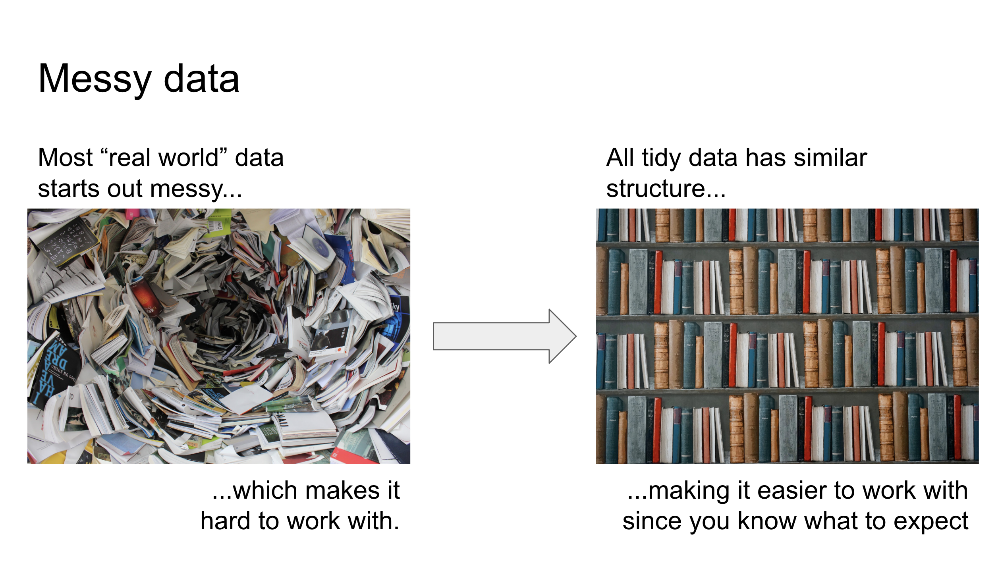
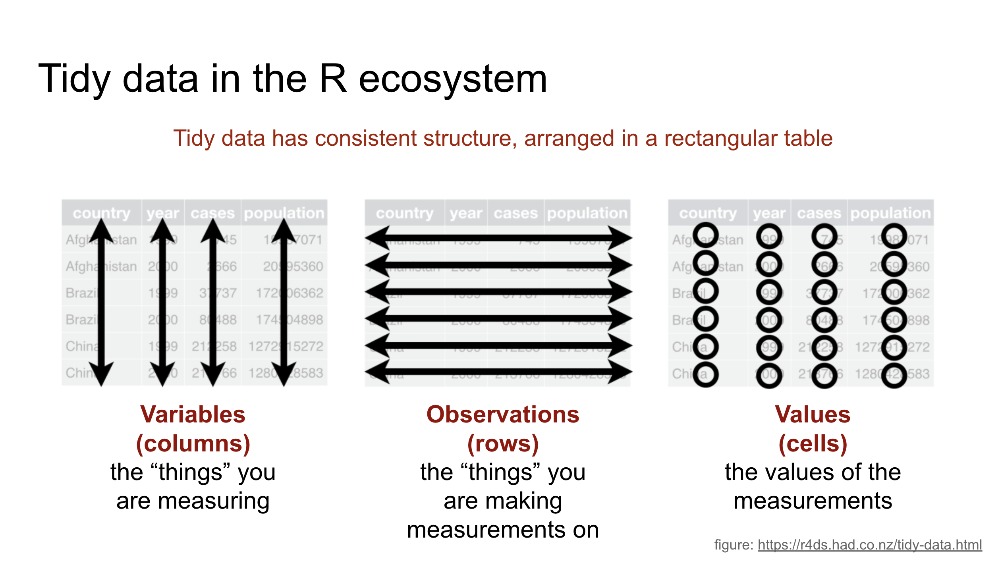
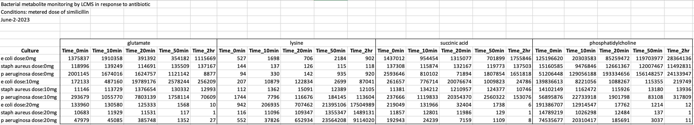
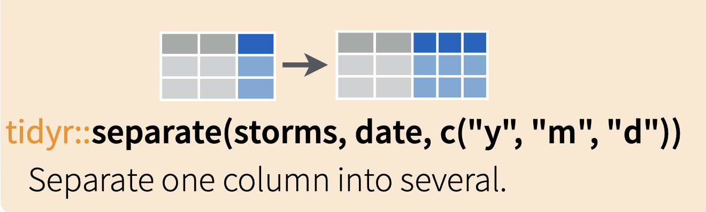

# Data Wrangling
In data analysis, having known and expected patterns in the data is important. Wrangling is the act of getting messy real world data organized for analysis.

```{r 7201, echo=FALSE, fig.cap="\\label{fig:7201}Visualizing messy data."}

```
## Tidy Data

Tidy data is a concept in data science and statistics that refers to a specific way of organizing data into a tabular format that is easy to work with. The concept of tidy data was introduced by Hadley Wickham in his paper "Tidy Data" published in the Journal of Statistical Software in 2014.

In tidy data, each row represents a single observation or record, and each column represents a single variable or attribute. Additionally, there should be no duplicate columns or rows, and each cell should contain a single value.

More specifically, tidy data should have the following properties:

1. Each variable has its own column: In tidy data, each variable or attribute should have its own column. This makes it easy to compare and analyze different variables.

2. Each observation has its own row: In tidy data, each observation or record should have its own row. This makes it easy to perform calculations on individual observations or groups of observations.

3. There should be no duplicate columns or rows: In tidy data, there should be no duplicate columns or rows. This ensures that the data is organized in a clear and concise manner.

4. Each cell should contain a single value: In tidy data, each cell should contain a single value. This makes it easy to perform calculations and manipulate the data.

By organizing data in a tidy format, it becomes easier to analyze and visualize the data using tools like R and Python. Additionally, tidy data is more robust and less prone to errors than other types of data formats, making it easier to work with and share with others.

Tidy data visualized:
```{r 7202, echo=FALSE, fig.cap="\\label{fig:7202}Visualizing tidy data concepts."}

```

## Example data wrangling using `dplyr`

We have a processed MS data set of metabolites measured for different bacteria at different time-points with different dosages of an antibiotic. 

```{r 7203, echo=FALSE, fig.cap="\\label{fig:5202}Checking our messy data table."}

```
Having a look at the data, we can see definitely that it is not tidy.

Our goal will be to:
* Read excel data with `readxl` library.
* In a single *dplyr* pipe create a tidy with `culture`, `dose_mg`, `metabolite`, `time_min`, `abundance` as our columns.

Let's start with the read-in.

```{r}
require(readxl)
require(tidyverse)

# read_excel can read portions of the excel
met_df <- read_excel("data/bacterial-metabolites_dose-simicillin_wide.xlsx")
met_df
```

Let's `separate` Culture into two new variables: Species and Dose.

```{r 7204, echo=FALSE, fig.cap="\\label{fig:7203}Separating columns in a tibble."}

```

```{r}
met_df %>%
  separate(Culture, c("culture", "dose_mg"), sep = " dose:")
```


Still some issues here. We managed a separation but out dose column isn't numeric!
We need to remove the "mg".

```{r 7205, echo=FALSE, fig.cap="\\label{fig:7204}Mutate:Making new columns or changing existing ones."}

```

```{r}
met_df %>%
  separate(Culture, c("culture", "dose_mg"), sep = " dose:") %>%
  mutate(Dose = str_remove(dose_mg, "mg"))
```

Ok, the "mg" is removed but if we check the tibble, `Dose` is still `chr`, so it's still computed as text by R! Let's make it numeric. 

```{r}
met_df %>%
  separate(Culture, c("culture", "dose_mg"), sep = " dose:") %>%
  mutate(dose_mg = str_remove(dose_mg, "mg")) %>%
  mutate(dose_mg = as.numeric(dose_mg))
```
Now, we have a bigger problem... multiple pieces of information encoded into each column!
We need this tibble to be **long** rather than **wide** to by tidy. We can use `pivot_longer` from `tidyr`.

```{r 7206, echo=FALSE, fig.cap="\\label{fig:7205} Pivoting longer from wide data."}
knitr::include_graphics("images/pivot-longer-vis.png")
```

```{r}
met_df %>%
  separate(Culture, c("culture", "dose_mg"), sep = " dose:") %>%
  mutate(dose_mg = str_remove(dose_mg, "mg")) %>%
  mutate(dose_mg = as.numeric(dose_mg)) %>%
  pivot_longer(cols = 3:22, names_to = "metabolite_time", values_to = "abundance")
```
Another happy table...but **STILL** has multiple data encoded in a single column!

```{r}
met_df %>%
  separate(Culture, c("culture", "dose_mg"), sep = " dose:") %>%
  mutate(dose_mg = str_remove(dose_mg, "mg")) %>%
  mutate(dose_mg = as.numeric(dose_mg)) %>%
  pivot_longer(cols = 3:22, names_to = "metabolite_time", values_to = "abundance") %>%
  separate(metabolite_time, c("metabolite", "time_min"), sep="_")
```

```{r}
met_df %>%
  separate(Culture, c("culture", "dose_mg"), sep = " dose:") %>%
  mutate(dose_mg = str_remove(dose_mg, "mg")) %>%
  mutate(dose_mg = as.numeric(dose_mg)) %>%
  pivot_longer(cols = 3:22, names_to = "metabolite_time", values_to = "abundance") %>%
  separate(metabolite_time, c("metabolite", "time_min"), sep="_", convert = TRUE)
```


Almost there, but notice how `metabolite_time` has three items when we separate by `_`?
glutamate_Time_0min -> `glutamate`_`Time`_`0min`
We only provided two column names, though. Perhaps we can rethink our separator. 
```{r}
met_df %>%
  separate(Culture, c("culture", "dose_mg"), sep = " dose:") %>%
  mutate(dose_mg = str_remove(dose_mg, "mg")) %>%
  mutate(dose_mg = as.numeric(dose_mg)) %>%
  pivot_longer(cols = 3:22, names_to = "metabolite_time", values_to = "abundance") %>%
  separate(metabolite_time, c("metabolite", "time_min"), sep="_Time_") %>%
  mutate(
    time_min = case_when(
      grepl("min", time_min, ignore.case = TRUE) ~ as.numeric(gsub("min", "", time_min)),
      grepl("hr", time_min, ignore.case = TRUE) ~ as.numeric(gsub("hr", "", time_min)) * 60
    )
  )
```
Ok a new problem has appeared: mixed time units in our `time_min` column. We have both "min" and "hr". We need to standardize to understand these as time units. We can `mutate` with `case_when`, which does specific things conditionally on particular observations in the tibble. This is a `dplyr` way of doing if statements. We will also advance it up by doing the "character" to "numeric" conversion in one go!
```{r}
tidy_met_df <- met_df %>%
  separate(Culture, c("culture", "dose_mg"), sep = " dose:") %>%
  mutate(dose_mg = str_remove(dose_mg, "mg")) %>%
  mutate(dose_mg = as.numeric(dose_mg)) %>%
  pivot_longer(cols = 3:22, names_to = "metabolite_time", values_to = "abundance") %>%
  separate(metabolite_time, c("metabolite", "time_min"), sep="_Time_") %>%
  mutate(
    time_min = case_when(
      grepl("min", time_min, ignore.case = TRUE) ~ as.numeric(gsub("min", "", time_min)),
      grepl("hr", time_min, ignore.case = TRUE) ~ as.numeric(gsub("hr", "", time_min)) * 60
    )
  )
tidy_met_df
```
Now we can examine our tibble and confirm that once and for all, it is tidy. Let's save it for later use. We can also pipe in our saving.

```{r}
met_df %>%
  separate(Culture, c("culture", "dose_mg"), sep = " dose:") %>%
  mutate(dose_mg = str_remove(dose_mg, "mg")) %>%
  mutate(dose_mg = as.numeric(dose_mg)) %>%
  pivot_longer(cols = 3:22, names_to = "metabolite_time", values_to = "abundance") %>%
  separate(metabolite_time, c("metabolite", "time_min"), sep="_Time_") %>%
  mutate(
    time_min = case_when(
      grepl("min", time_min, ignore.case = TRUE) ~ as.numeric(gsub("min", "", time_min)),
      grepl("hr", time_min, ignore.case = TRUE) ~ as.numeric(gsub("hr", "", time_min)) * 60
    )
  ) %>%
  write_csv("data/tidyed-met-df.csv")

```

One thing you can notice is how the dplyr verbs add up. We can continually pipe one data frame through a series of wrangling steps until we are satisfied. Operating in this way organizes processes in a way that is easy to manage. We could also do this:

```{r}
# read_excel can read portions of the excel
no_pipe_met_df <- read_excel("data/bacterial-metabolites_dose-simicillin_wide.xlsx")

no_pipe_met_df <- separate(no_pipe_met_df, Culture, c("culture", "dose_mg"), sep = " dose:")
no_pipe_met_df <- mutate(no_pipe_met_df, dose_mg = str_remove(dose_mg, "mg"))
no_pipe_met_df <- mutate(no_pipe_met_df, dose_mg = as.numeric(dose_mg))
no_pipe_met_df <- pivot_longer(no_pipe_met_df, cols = 3:22, names_to = "metabolite_time", values_to = "abundance")
no_pipe_met_df <- separate(no_pipe_met_df, metabolite_time, c("metabolite", "time_min"), sep="_Time_")
no_pipe_tidy_met_df <-  mutate(no_pipe_met_df,
    time_min = case_when(
      grepl("min", time_min, ignore.case = TRUE) ~ as.numeric(gsub("min", "", time_min)),
      grepl("hr", time_min, ignore.case = TRUE) ~ as.numeric(gsub("hr", "", time_min)) * 60
    )
  )

no_pipe_tidy_met_df
```
### Working with tidy data allows rapid summarization

Now we have a tidy tibble, we can summarize very rapidly.

```{r}
tidy_met_df %>%
  group_by(culture, metabolite) %>%
  summarize(mean = mean(abundance))
```

What other questions can we ask???