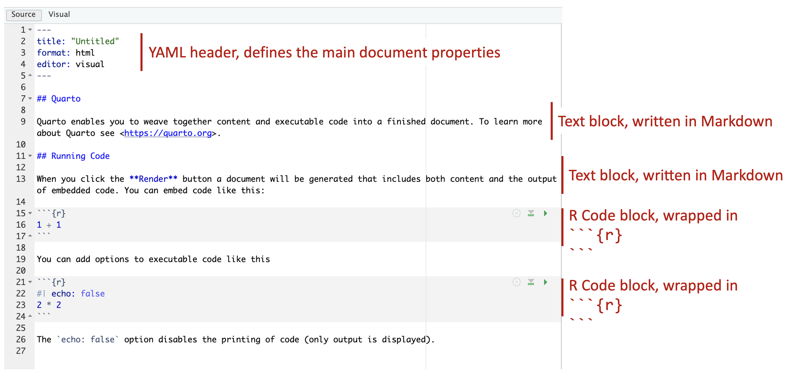
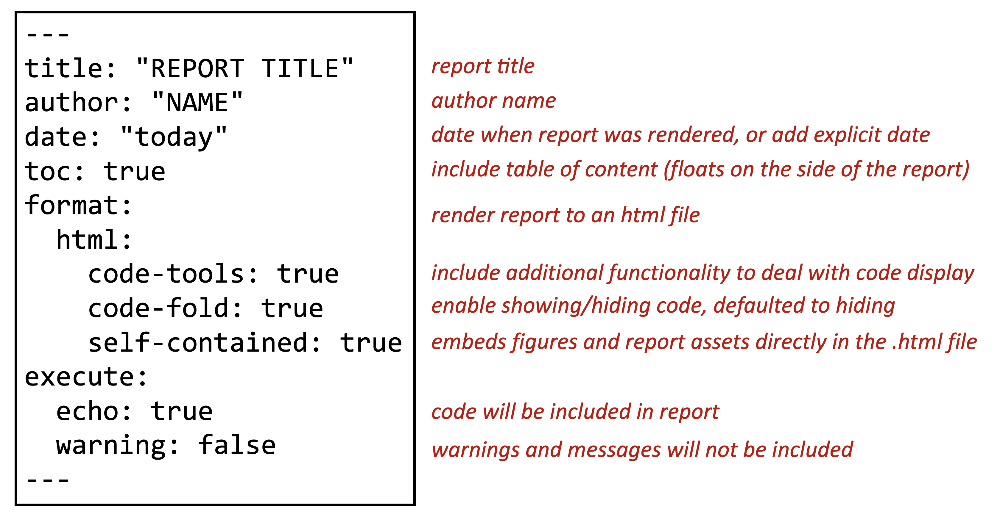
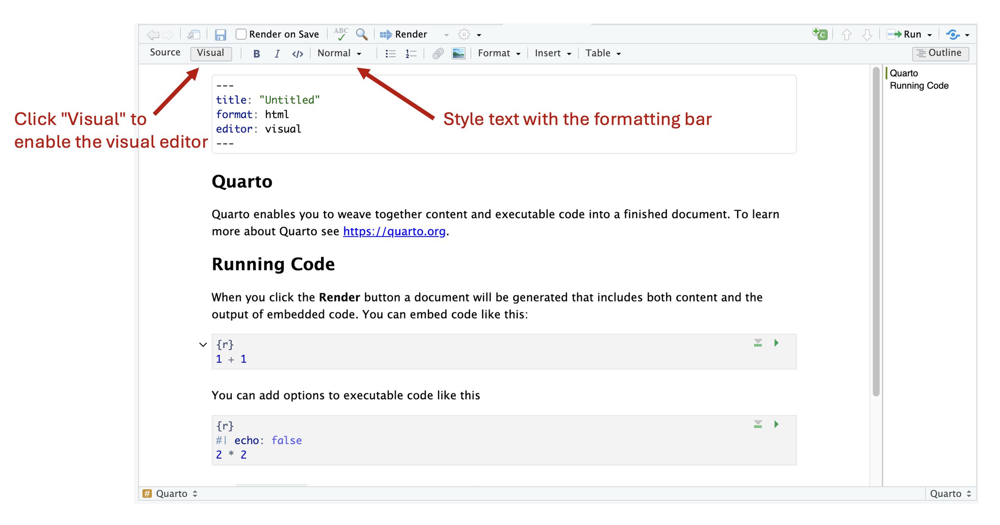
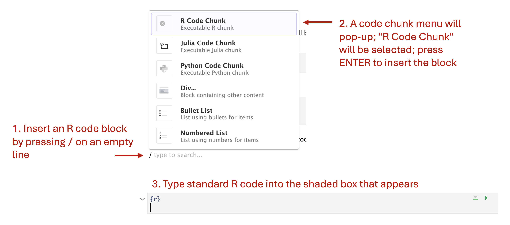
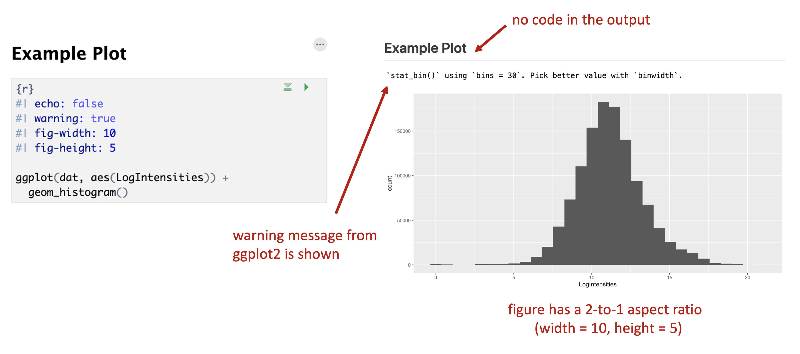

## Quarto

[Quarto](https://quarto.org) is a modern "open-source scientific and technical publishing system" created by Posit. For many years, RMarkdown (also developed and supported by Posit/RStudio) was the default data science notebook platform for R users. However, development for RMarkdown was stopped several years ago and efforts are now focused on Quarto, which also supports other languages including Python.

Quarto is an extremely power system that not only allows one to make data science notebooks, but also books, websites, reports and presentations. See the [Quarto Gallery](https://quarto.org/docs/gallery/) for examples of what Quarto can do.

+---------------------------------+-------------------------------------------------------------------------------------------------------------------------------------+
| {height="68"} | **Installing Quarto**: Before you can use Quarto in RStudio, you need to first install it.  Follow the instructions on the          |
|                                 |                        [Quarto Get Started](https://quarto.org/docs/get-started/) page.                                             |
+---------------------------------+-------------------------------------------------------------------------------------------------------------------------------------+


In a Quarto document, you write text documentation and R code in the same text file with a .qmd file extension. RStudio makes it easy to work with Quarto documents, as summarized in the following workflow:

1. Create a new .qmd file: `File --> New File --> Quarto Document...`
2. Write/edit the .qmd file using either the *source* or *visual* editor
3. Once finished, render the file to an output document, such as a PDF or HTML file

You can think of editing a .qmd file just like editing an R script, but with added emphasis on also including well organized text documentation about your methods and accompanying R code. In older versions of RStudio, the only way to edit notebooks (which were RMarkdown notebooks at the time) was to use the source editor, the same one used to edit R scripts. However, RStudio has recently gained the ability to edit .qmd documents using a visual editor. In the source editor, everything, including the text documentation, is written with code. This meant that you had to also learn the markup language [Markdown](https://daringfireball.net/projects/markdown/) and some HTML to effectively write the text documentation. However, with the addition of the visual editor to RStudio, you can now write text documentation in a text-editor-like manner (e.g. like in Microsoft Word), removing the need to learn additional computer languages.

There are three main components to a .qmd document:

1. A YAML header that defines the documention options and parameters
2. Text blocks where you document your work, analysis, and code
3. Code blocks where write R code to do the actual analysis work

Each of these will be described in more detail in the following sections.

```{r 9031, echo=FALSE, fig.cap="\\label{fig:9031}Basic components of a Quarto document.", fig.align='center'}

```


### YAML Headers

The YAML header is place at the top of a .qmd file and defines global properties of the document (e.g. title, author, date, output format). While there are a lot of possible options you can specify in the YAML, beginners can just copy and paste the same default template (given below) which covers good default settings for scientific reports.

```{r, eval = FALSE}
---
title: "REPORT TITLE"
author: "NAME"
date: "today"
toc: true
format:
  html:
    code-tools: true
    code-fold: true
    self-contained: true
execute: 
  echo: true
  warning: false
---

```

```{r 9032, echo=FALSE, fig.cap="\\label{fig:9032}Quarto YAML header example.", fig.align='center'}

```

In the example YAML header above, many of the options are self explanatory: `title`, `author` and `date` are used to specific exactly what they say. In the `date` option, you can supply a formatted date string (e.g. 2024-06-01), or use the shortcut "today" to insert today's date (as of the time of rendering the document).

The `toc` option indicate whether or not you want a table of contents included in the documjent (use false if you don't).

The `format` options are a bit more complex, but essentially say that we want HTML output along with some additional options about how code is displayed in the document.

Finally, the `execute` options specify how the code blocks are handled. In this case, `echo: true` means we want to include the printing of code in our output document, and `warning: false` means we want to suppress the printing of R warnings in our ouptut document.

The YAML header content is sandwiched between `---` at the top and bottom, with options specified in the middle.  These options take the form of a defined keyword (e.g. `title`), followed by a `:` and the value that specifies the option. The options supplied in the header are *global*, meaning they apply to all the following blocks in the document.  For example, it's possible to define default figure size in the YAML header.  While you can individually override figure size in each code block, the figure size defined in the YAML will be used by default. There are [a lot of options](https://quarto.org/docs/reference/formats/opml.html) you can configure in the YAML header. But for basic usage, the above header is a great place to start.


### Text Blocks

After the YAML header is added, the next step is to intertwine text and code blocks needed to perform the analysis task. There is no limit to the number or length of the text and code blocks: use as many as you need to properly communicate your work. As a shortcut in the visual editor, you can type `/` on a blank line to bring on an *insert palette* which provides a list of block types to add to your document, including not only text and code blocks, but also things like bulleted lists, tables and links.

With the visual editor, you can style text using the formatting bar in the editor pane. Furthermore, many standard text editing keyboard shortcuts are also available to use (e.g. CTRL/CMD+B to bold text). When writing text documentation, it is also good practice to make use of heading levels to organize your document by defining sections for your content. By default, the document title (supplied in the YAML header) has the top heading level of 1. Therefore, additional sections in your document should start a level heading 2 and higher. For example, in a report, you may start with a **Summary** section (heading level 2) which provides an overview of your analysis, information about the input data, and an overview of the methods used. This could be followed with an **Analysis** section (heading level 2) that goes into the analysis details and code. If you have a more complex analysis, you may further divide the **Analysis** section into subgroups (heading levels 3) to describe individual components of the analysis. Finally, you may add a **Conclusions** section (heading level 2) to summarize the main results and findings.  How you organize your document is completely up to you, but following standard writing procedures that you use in other contexts (e.g. when writing publications or reports in school) is recommended. As an added benefit, level heading sections are used to automatically generate a table of contents, which can be particularly useful for longer documents.

```{r 9033, echo=FALSE, fig.cap="\\label{fig:9033}Visual editor for Quarto documents.", fig.align='center'}

```

### Code Blocks 

Code blocks are where you enter R code to perform the actual analysis work. You can easily insert an R code block by typing `/` on a empty line in the .qmd file. This will bring up a block selection interface where you can select different types of block and objects to insert, including an R code block (first item in the interface by default). Once you add an R code block, you will see a new section added to the document with `{r}` at the top and a shaded background. This indicates you now have an R code block, and you can enter your R code into this shaded area. The green right facing triangle in the upper right side of the code block allows you to execute the code inside the block in the console. This is useful if you want to test out the code you've written.

```{r 9034, echo=FALSE, fig.cap="\\label{fig:9034}R Code blocks can be inserted using the / menu", fig.align='center'}

```

When adding code to your document, you don't need, nor is it suggested, to enter all your analysis code into a single block. Rather, it usually makes sense to break-up your analysis code into smaller pieces, interspersed with text blocks documenting your work. This makes it easier for you to develope your analysis, and for someone else to follow what you did. Like a standard R script, R code blocks are executed from top to bottom in the document, and any defined variables are accessible to all blocks that follow.

Unlike text blocks, which directly display the entered text into the output document, the output from code blocks depends on the options specified either in the YAML header (global options) or individually for each R code block. For example, you can control whether or not R code, the output from the code, and warning/error messages are shown in the output document. In the YAML header shown above, the options that are part of the `execute:` section indicate that R code should be output (`echo: true`) and warning messages should not (`warning: false`). Because these options are specified in the YAML header, all R code blocks will follow these options unless different options are specified within an R code block.

Code block level options can be specified at the top of a code block, by typing `#| ` followed by an option string. Multiple options can be specified by entering them on multiple lines. Some useful code block options include:

- `fig-width:`, `fig-height:` control the width and height of a plot
- `fig-cap:` add a figure caption
- `echo:` whether or not to display code
- `warning:` whether or not to display warning or error messages
- `eval:` whether or not to actually execute the code when rendering (useful if you just want to output code)

An example of using code block options and how they affect output is shown in the figure below.

```{r 9035, echo=FALSE, fig.cap="\\label{fig:9035}Example code block options and associated output.", fig.align='center'}

```


### Rendering

After you have finished writing a .qmd file, the final step is to render it into an output document. This can be easily accomplished by clicking the `Render` button in the tool bar of the Quarto editor pane inside of RStudio. The format of the output is indicated by the options set in the YAML header. For reports, PDFs and HTML files are useful output options. In practice, HTML output is highly suggested because HTML allows for interactivity in the document (like for webpages) that isn't possible with PDF files. For example, HTML output allows you to have a floating table of contents within your document, and with more advanced R coding, you can also include interactive plots in your output. Furthermore, since web browsers are ubiquitous, HTML files can be opened by anyone and on any platform.


