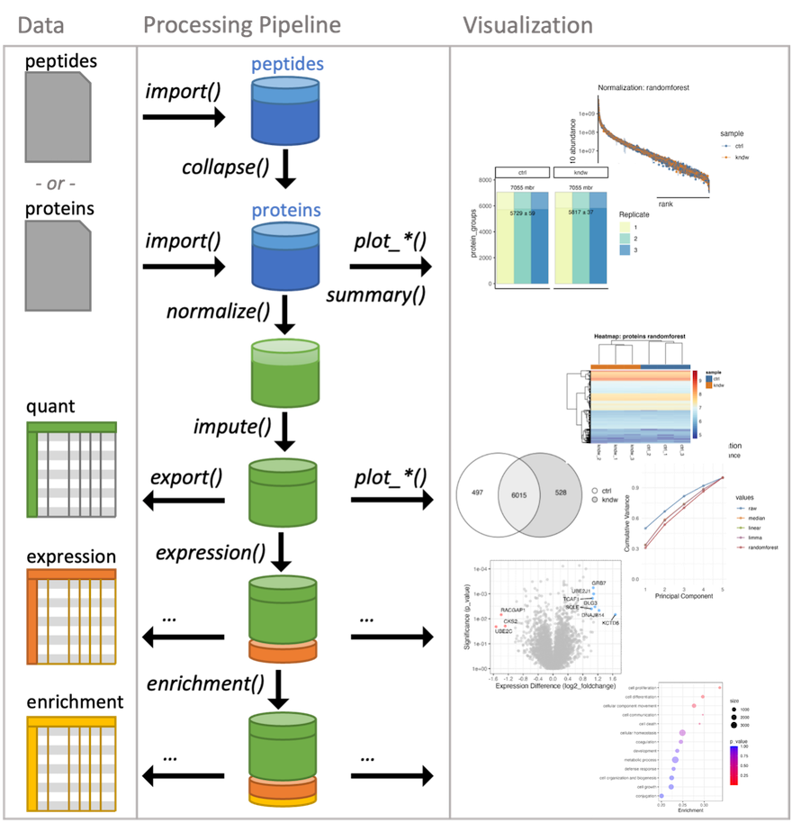

### Tidyproteomics

The tidyproteomics R package is a tool that provides a set of functions to preprocess and analyze proteomics data using the tidy data framework. This package is built on top of the tidyverse and Bioconductor packages, which are widely used in the R community for data manipulation and analysis.

\

+-----------------------------------------------------+-------------------------------------------------------------------+
| {height="99"} | [WEB manual](https://jeffsocal.github.io/tidyproteomics/)         |
|                                                     |                                                                   |
|                                                     | [GitHub](https://github.com/jeffsocal/tidyproteomics)             |
|                                                     |                                                                   |
|                                                     | [WEB App](https://bioinformatics.pel.caltech.edu/tidyproteomics/) |
+-----------------------------------------------------+-------------------------------------------------------------------+

\

Some of the main features of the tidyproteomics package include:

-   Data preprocessing functions for common tasks such as filtering, normalization, and imputation.
-   Functions for quality assessment and visualization of proteomics data.
-   Integration with other Bioconductor packages for downstream analysis such as differential expression analysis and pathway analysis.

```{r 10001, echo=FALSE, fig.cap="\\label{fig:10001}tidyproteomics workflow", fig.align='center', fig.width=4}

```


#### Installation {-}

To install the `tidyproteomics` package, you will need to install GitHub and Bioconductor repositories:

```{r, eval=FALSE}
install.packages("devtools")
devtools::install_github("jeffsocal/tidyproteomics")

install.packages("BiocManager")
BiocManager::install(c("limma","qvalue","fgsea","Biostrings"))
```

#### Loading Data {-}

To load your data into tidyproteomics, you can use the following code:

```{r, eval=FALSE}
# Load the tidyproteomics package
library(tidyproteomics)

# Import data
data_proteins <- "path_to_data.xlsx" %>%
  import("ProteomeDiscoverer", "proteins") 
```

```{r, echo=FALSE, message=FALSE, warning=FALSE}
# Load the tidyproteomics package
library(tidyproteomics)

# Import data
data_proteins <- hela_proteins
```

#### Data Summaries {-}

Currently, tidyproteomics implements two summary quantitative visualizations. The first is a simple grouped bar chart that displays individual and grouped proteins, as well as all and unique peptides. The match-between-runs is shown as a margin above the MS2 evidenced identifications. In recent literature, a summary of protein quantitation has been visualized as a rank-based dot plot. This plot can be extended to highlight statistical differences via an unbiased all-pair-wise comparison, which gives an anticipated view on how to guide downstream analyses.

```{r, warning=FALSE}
p01 <- data_proteins %>% plot_counts()
p02 <- data_proteins %>% plot_quantrank()
```

```{r, echo=FALSE, fig.width=8, fig.height=3, fig.align='center'}
grid.arrange(p01 + labs(title = '', subtitle = 'p01: Protein Counts'), 
             p02 + labs(title = '', subtitle = 'p02: Quantitation Rank Plot'), nrow = 1)
```


Summary Stats {-}

Summarizing proteomics data is vital to understanding the bigger picture and conveying summary stats that set the tone for the larger analysis. The results of each summary can be directed to via the destination option to "print" on screen, "save" to a file or "return" as a tibble.

```{r, eval=FALSE}
data_proteins <- data_proteins %>%
  # save a table of simple summary stats
  summary("sample", destination = "save") %>%
  # save a report on contamination
  summary(contamination = "CRAP", destination = "save") %>%
  # remove contamination
  subset(!description %like% "^CRAP")
```

#### Normalization and Imputation {-}

Quantitative proteomics requires accurate normalization, which can be difficult to implement. The `normalize()` function in the tidyproteomics package is a wrapper for various normalization methods, while `select_normalization()` automatically selects the best method based on a weighted score. Both functions allow for downstream analyses such as `expression()` and `enrichment()`. The package attempts to apply each function universally to peptide and protein values using the `identifier` variable to identify the thing being measured.

```{r, warning=FALSE, message=FALSE}
data_proteins <- data_proteins %>%
  # normalize via several methods, best method will be automatically selected
  normalize(.method = c("median","linear","limma","randomforest")) %>%
  # impute with a minimum value (this is a knock-out)
  impute(base::min)

# plot visualizations comparing normalization methods
p03 <- data_proteins %>% plot_normalization()
p04 <- data_proteins %>% plot_variation_cv()
p05 <- data_proteins %>% plot_variation_pca()
p06 <- data_proteins %>% plot_dynamic_range()
```

```{r, echo=FALSE, fig.width=8, fig.height=3, fig.align='center'}
grid.arrange(p04 + labs(title = '', subtitle = 'p04: Normalization CVs'), 
             p05 + labs(title = '', subtitle = 'p05: Normalization PCA'), 
             nrow = 1)
```
```{r, echo=FALSE, fig.width=8, fig.height=3, fig.align='center', warning=FALSE, message=FALSE}
data_proteins %>% subset(imputed == 0) %>% plot_dynamic_range() + labs(title = '', subtitle = 'p06: Normalization Dynamic Range')
```

```{r}
# plot visualizations of unbiased clustering
p07 <- data_proteins %>% plot_heatmap()
p08 <- data_proteins %>% plot_pca()
```

```{r, echo=FALSE, fig.width=8, fig.height=3, fig.align='center'}
grid.arrange(p07[[4]], 
             p08 + labs(title = '', subtitle = 'p08: PCA'), 
             nrow = 1)
```

#### Expression Analysis {-}

```{r, eval=FALSE}
data_proteins <- data_proteins %>%
  # calculate the expression between experiment: ko and control: wt
  expression(kndw/ctrl) %>%
  # plot the expression analysis
  plot_volcano(kndw/ctrl, destination = "png", significance_column = "p_value") %>% 
  plot_proportion(kndw/ctrl, destination = "png")
```

Overall, the tidyproteomics package provides a useful set of tools for preprocessing and analyzing proteomics data using the tidy data framework in R. There are several more workable examples in the online documentation.

---
